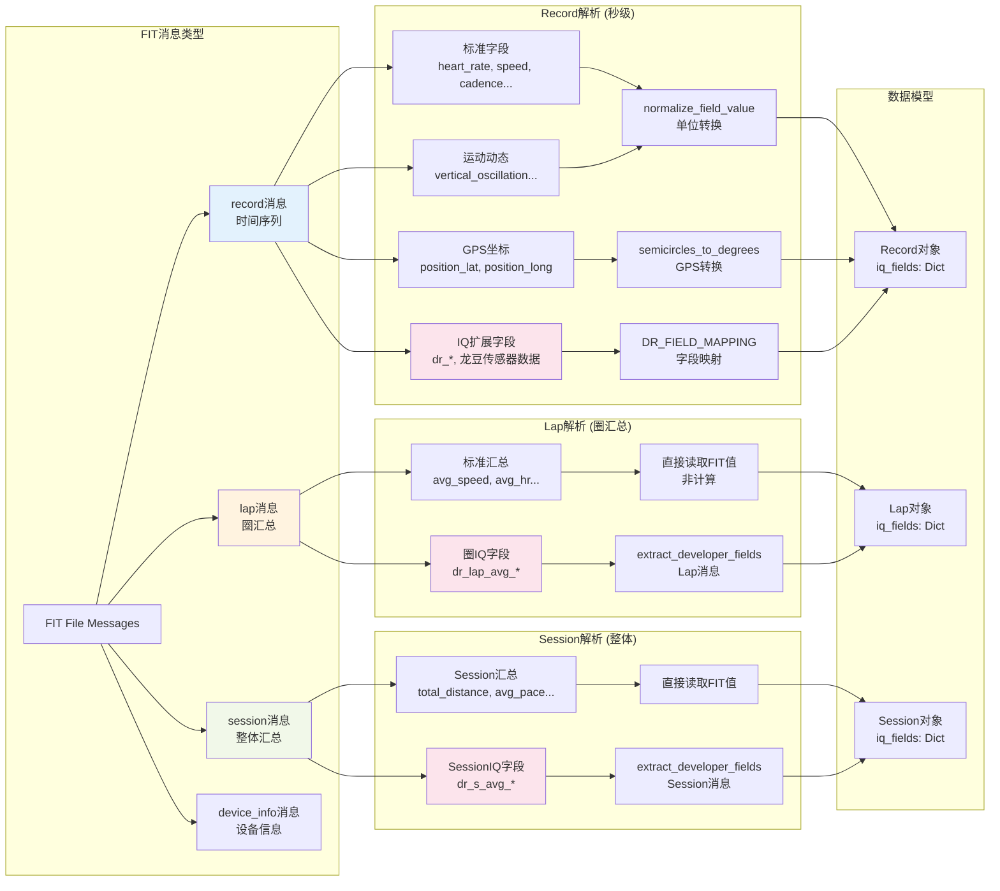
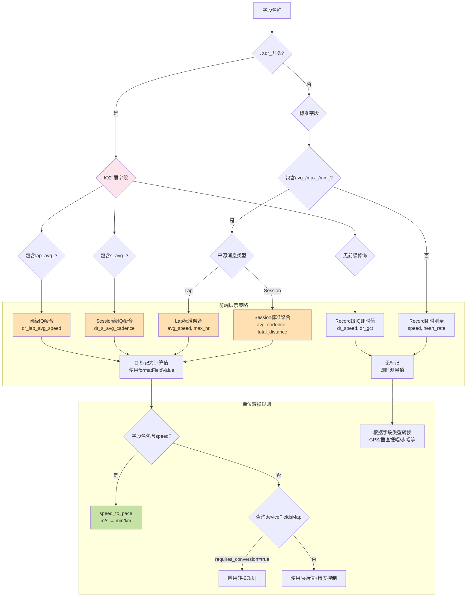
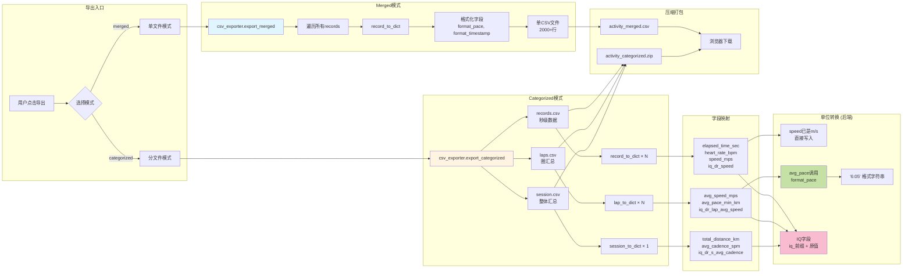
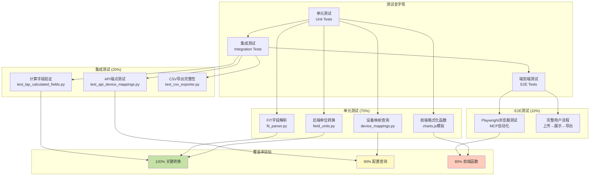
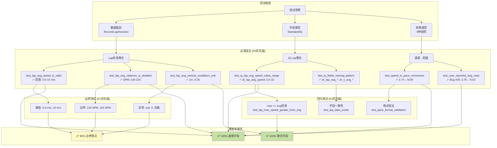
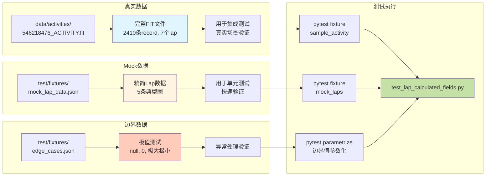
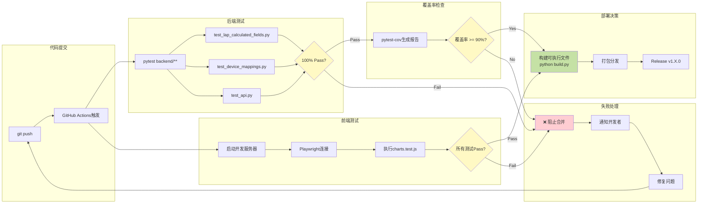

# FIT跑步数据分析器 系统设计文档 (SDD)

## 开发规范 (Development Guidelines)

### 版本管理规范 (Version Management)

**重要原则：单一版本源 (Single Source of Truth)**

所有版本信息必须从 `config.py` 的 `VERSION` 常量读取，禁止在其他文件中硬编码版本号。

**版本号定义位置：**
- 📍 **唯一来源**: `config.py` → `VERSION = "x.y.z"`

**自动读取版本号的组件：**
- ✅ `build.py` - 构建脚本自动导入 `from config import VERSION`
- ✅ `backend/main.py` - 启动信息和 `/api/version` 接口读取
- ✅ `frontend/js/app.js` - 通过 API 获取并显示在 UI
- ✅ `fitanalysis.spec` - 手动同步更新（PyInstaller限制）

**禁止的做法：**
- ❌ 在其他 Python 文件中定义版本号常量
- ❌ 在 JavaScript 中硬编码版本号
- ❌ 在文档中手动维护版本号（应引用或自动生成）

**版本号格式：**
- 遵循语义化版本规范 (Semantic Versioning)
- 格式: `Major.Minor.Patch`
- 示例: `"1.6.0"`

---

### 版本发布前检查清单 (Pre-Release Checklist)

**⚠️ AGENT契约：每次构建前必须执行 `pre_build_check.py`**

在执行构建(build)之前，必须运行自动化检查脚本：

```bash
python pre_build_check.py
```

**契约要求：**
1. **强制执行**: 构建前必须先运行检查脚本，确保所有检查项通过
2. **零容忍**: 任何检查失败都必须先修复，不允许带问题构建
3. **文档更新**: 每次更新 `agent.md` 后，必须重新运行检查脚本确认
4. **版本同步**: 确保 `config.py`, `fitanalysis.spec`, `agent.md` 版本号一致

**检查脚本覆盖范围：**

1. **版本号检查** (Version Consistency):
   - ✅ `config.py` VERSION 定义
   - ✅ `fitanalysis.spec` CFBundleShortVersionString 同步
   - ✅ `fitanalysis.spec` CFBundleVersion 同步
   - ✅ `RELEASE_v{VERSION}.md` 文档存在

2. **配置检查** (Configuration Validation):
   - ✅ `config.py` PORT = 8082
   - ✅ `config.py` HOST = 127.0.0.1 或 localhost

3. **核心模块检查** (Core Modules):
   - ✅ backend/main.py 存在
   - ✅ backend/device_mappings.py 存在并可导入
   - ✅ backend/field_units.py 存在
   - ✅ backend/fit_parser.py 存在
   - ✅ backend/data_store.py 存在
   - ✅ backend/csv_exporter.py 存在
   - ✅ backend/models.py 存在
   - ✅ backend/hr_csv_merge.py 存在

4. **Frontend文件检查** (Frontend Files):
   - ✅ frontend/index.html 存在
   - ✅ frontend/css/styles.css 存在
   - ✅ frontend/js/app.js 存在
   - ✅ frontend/js/charts.js 存在
   - ✅ frontend/js/export.js 存在

5. **构建配置检查** (Build Configuration):
   - ✅ fitanalysis.spec hiddenimports 包含所有核心模块
   - ✅ build.py 存在
   - ✅ run.bat (Windows) 存在
   - ✅ run.sh (macOS) 存在

6. **文档检查** (Documentation):
   - ✅ README.md 存在
   - ✅ agent.md 存在
   - ✅ agent.md 包含当前版本记录

**通过标准：**
- 所有检查项必须全部通过 (100% pass rate)
- 脚本退出码为 0
- 输出显示 "✓ 可以安全构建 v{VERSION}"

**失败处理：**
- 修复所有失败项
- 重新运行检查脚本
- 不允许跳过任何检查项

---

### 手动检查清单 (Manual Checklist - 可选)
以下为补充性手动检查，自动化脚本未覆盖的部分：

1. **跨平台一致性**: 
   - ✅ 确保 Windows 和 macOS 的功能和 UI 完全一致
   - ✅ 验证英文文本在两个平台上显示正确
   - ✅ 使用相同的测试数据进行功能验证

2. **代码提交**:
   - ✅ 所有变更已提交到 Git
   - ✅ 确保无未追踪的重要文件

---

## 1. 项目概述

### 1.1 项目名称
FIT Running Data Analyzer (FIT跑步数据分析器)

### 1.2 项目描述
一个本地Web应用，用于解析Garmin等运动设备产生的FIT文件，提供类似Garmin Connect的活动管理体验。支持秒级数据趋势图展示、每圈汇总表格、双字段叠加对比、多活动对比分析，以及灵活的CSV导出功能。

**支持平台**: Windows, macOS

### 1.3 项目目标
- [x] 解析FIT文件，自动提取所有字段（包括IQ Pod扩展字段如龙豆跑步dr_字段）
- [x] 本地存储活动数据，提供活动列表管理（排序、过滤、分页）
- [x] 展示秒级趋势图和每圈汇总数据
- [x] 支持双字段叠加对比和多活动多字段矩阵式对比（时间/距离对齐可选）
- [x] X轴支持时间/距离切换显示
- [x] 配速字段自动转换显示（min/km）
- [x] 提供悬停显示细节数据功能
- [x] 支持分类或合并导出CSV
- [x] 跨平台支持（Windows、macOS）
- [x] 双击启动自动打开浏览器

### 1.4 项目范围
- **包含功能**: FIT文件上传解析、活动存储管理、趋势图可视化、字段叠加对比、多活动对比、CSV导出、X轴时间/距离切换、跨平台打包
- **不包含功能**: 用户认证、云端同步、地图路线展示、社交分享

## 2. 需求分析

### 2.1 功能需求
| 需求ID | 功能描述 | 优先级 | 状态 |
|--------|----------|--------|------|
| FR001 | 上传FIT文件并解析 | High | DONE |
| FR002 | 动态提取所有字段（含IQ扩展字段、dr_龙豆字段） | High | DONE |
| FR003 | 存储活动数据到本地JSON | High | DONE |
| FR004 | 活动列表展示（类Garmin Connect） | High | DONE |
| FR005 | 活动列表排序（日期/距离/时长/配速） | Medium | DONE |
| FR006 | 活动列表过滤（日期范围/距离范围） | Medium | DONE |
| FR007 | 秒级趋势图展示（可选字段） | High | DONE |
| FR008 | 每圈汇总表格展示 | High | DONE |
| FR009 | 双字段叠加对比（同图多trace） | High | DONE |
| FR010 | 多活动多字段矩阵式对比（活动×字段，时间/距离对齐可选） | High | DONE |
| FR011 | 鼠标悬停显示细节数据 | High | DONE |
| FR012 | CSV导出（merged/categorized模式） | Medium | DONE |
| FR013 | X轴时间/距离切换按钮 | Medium | DONE |
| FR014 | 配速字段自动转换显示(min/km) | Medium | DONE |
| FR015 | elapsed_time自动计算（从时间戳推算） | Medium | DONE |
| FR016 | 字段在趋势图上显示加上前缀。格式如DR_步频。 | Medium | DONE |
| FR017 | (已合并到FR010) 多活动多字段矩阵式对比 | High | DONE |
| FR018 | 多活动日期时间戳 | High | DONE |
| FR019 | （取代FR017和FR010）多活动单字段对比，时间/距离可选 | High | DONE |
| FR020 | 打开网页时就loading本地存储的json 活动 |High|DONE|
| FR021 | 字段单位转换系统重构 - 配置化+智能检测 | High | DONE |
| FR022 | 统一字段选择器UI布局 - 多活动页面横向网格显示 | Medium | DONE |
| FR023 | 加入合并心率csv的功能 | medium | DONE |
| FR024 | 合并心率CSV时创建新活动（而非修改原活动） | Medium | ✅ DONE |
| FR025 | IQ速度字段配速显示对齐 - 统一所有速度字段单位和Y轴 | High | ✅ DONE |
| FR026 | macOS跨平台支持 | High | ✅ DONE |
| FR027 | 自动打开浏览器功能 | Medium | ✅ DONE |
| FR028 | UI版本号显示 | Low | ✅ DONE |
| FR029 | 端口变更8080->8082 | Low | ✅ DONE |
| FR030 | 应用图标支持 | Low | ✅ DONE |
| FR022 | 统一字段选择器UI布局 - 多活动页面横向网格显示 | Medium | DONE |
| FR023 | 加入合并心率csv的功能 | medium | DONE |
| FR024 | 合并心率CSV时创建新活动（而非修改原活动） | Medium | ✅ DONE |
| FR025 | IQ速度字段配速显示对齐 - 统一所有速度字段单位和Y轴 | High | ✅ DONE |


### 2.2 非功能需求
- **性能要求**: 10MB以内FIT文件解析时间<5秒，图表渲染流畅
- **可用性要求**: 本地运行，无需网络连接
- **安全要求**: 仅本地访问，无需认证
- **可扩展性**: 支持动态字段，无需硬编码IQ Pod类型
- **可维护性**: 模块化设计，代码注释完整

### 2.3 用户故事


#### US-001: 基础数据查看
```
作为 跑步爱好者
我希望 上传我的Garmin手表FIT文件，查看详细的跑步数据趋势图
以便 分析我的跑步表现，对比不同训练的效果

验收条件:
- [x] 可以上传.fit文件并自动解析
- [x] 可以在趋势图中选择显示心率、配速、步频等字段
- [x] 可以叠加两个字段进行对比
- [x] 悬停时显示该时间点的所有数据值
- [x] 可以选择多个活动进行多字段矩阵式对比分析
- [x] 可以导出数据为CSV文件
```
#### US-002: 单活动多字段对比
作为 跑步爱好者
我希望 在一个活动详情中同时查看多个指标的变化趋势
以便 理解不同指标之间的相关性（如心率和配速的关系）

验收条件:
- [x] 可以通过复选框选择多个字段（心率、步频、配速、功率等）
- [x] 不同字段使用不同颜色的曲线显示
- [x] 相同单位类型的字段共享Y轴（如心率字段共享左Y轴）
- [x] 配速字段自动转换为min/km格式显示
- [x] 支持X轴在时间和距离之间切换
- [x] 悬停时同时显示所有选中字段的当前值

#### US-003: 多活动多字段矩阵式对比（当前功能 - 完成- 已变更 - 参看US-004）
作为 跑步爱好者
我希望 同时对比多次训练的多个指标
以便 全面评估训练质量差异（如对比3次间歇跑的心率、配速、步频变化）

业务价值:

可以横向对比不同训练日的相同指标（如3次训练的心率曲线）
可以纵向对比同一训练的不同指标（如训练1的心率+配速+步频）
发现训练模式和瓶颈（如某次训练心率高但配速慢，说明状态不佳）

验收条件:
- [x] 对比视图支持多字段复选框选择（类似单活动详情视图）
- [x] 默认勾选"配速"字段（speed）
- [x] 字段列表为所有选中活动的字段并集
- [x] 如果某活动缺少某字段，该曲线在缺失部分显示为间断
- [x] 图表显示"活动数×字段数"条曲线（如3活动×2字段=6条曲线）
- [x] 曲线命名格式："活动名 - 字段名"（如"晨跑 - 心率"）
- [x] 颜色方案：每个活动使用一组颜色，该活动的不同字段使用该组内的不同颜色
- [x] 相同单位类型的字段共享Y轴（如所有心率字段共享左Y轴）
- [x] 配速字段自动转换为min/km格式
- [x] 限制：最多同时对比10个活动，最多选择5个字段
- [x] 显示已选活动列表，每个活动带颜色标识点
- [x] 字段选择器顶部提示："已选 X/5 个字段"
- [x] 多字段加载，legend需要加入日期时间戳来区分，直接前缀就可以。例如20251208_546218476。不能硬编码，从fit中读取。

技术约束:

  使用颜色方案A：每个活动一组颜色（如活动1用红色系，活动2用蓝色系）
  字段取并集：显示所有活动中出现过的任何字段
  X轴对齐保持当前的radio按钮方式（时间/距离互斥选择）
  后端API /api/compare 已支持多字段，无需修改

用户流程:

  在活动列表勾选2-10个活动
  点击"对比选中活动"按钮
  进入对比视图，看到选中活动列表（带颜色点）
  看到字段复选框区域，默认勾选"配速"
  勾选更多字段（如心率、步频），最多5个
  选择对齐方式（时间/距离）
  图表自动更新（300ms防抖延迟）
  查看多活动×多字段的矩阵式对比图表
  悬停查看具体数值
  取消勾选某些字段或活动，图表自动更新
示例场景:

  对比3次10km跑的配速+心率，看哪次训练效率最高
  对比5次间歇跑的步频+触地时间，评估跑步技术改善
  对比2次长距离的功率+心率+配速，分析配速策略差异

#### US-004: 多活动单字段对比（✅已完成）
作为 跑步爱好者
我希望 同时对比多次训练的单个指标
以便 全面评估训练质量差异（如对比3次间歇跑的心率变化）

验收条件:
- [x] 对比视图支持单字段单选框选择（radio而非checkbox）
- [x] 默认勾选"配速"字段（speed）
- [x] 字段列表为所有选中活动的字段并集
- [x] 如果某活动缺少某字段，该曲线在缺失部分显示为间断
- [x] 图表显示"活动数×1"条曲线（每个活动一条曲线）
- [x] 曲线命名格式："日期_文件ID - 字段名"（如"20251208_546564164 - 心率"）
- [x] 颜色方案：每个活动使用不同颜色
- [x] 单一字段使用单Y轴
- [x] 配速字段自动转换为min/km格式并反转Y轴
- [x] 限制：最多同时对比10个活动
- [x] 显示已选活动列表，每个活动带颜色标识点
- [x] 字段选择只允许单个，使用radio单选
- [x] legend包含日期时间戳前缀。格式：YYYYMMDD_FileID
- [x] 图表标题显示当前对比的字段名

实现说明：
  1. 前端修改：index.html更新UI，charts.js改为单选逻辑
  2. 后端无需修改：/api/compare已支持
  3. 优化：移除字段数量限制逻辑，简化Y轴配置

#### US-005: 打开网页时就loading本地存储的json 活动（✅已完成）
作为 跑步爱好者
我希望 打开网页时就loading已经在本地存储的活动
以便 浏览所有的活动记录和方便比较

验收条件:
- [x] 前端自动加载 - 页面加载时自动调用 /api/activities 接口
- [x] 无需用户点击任何按钮即可看到活动列表
- [x] 所有本地存储的活动都显示在列表中
- [x] 活动信息完整：日期、名称、距离、时长、配速、心率
- [x] 显示顺序默认按日期降序排列
- [x] 空状态处理：首次打开（无活动）时显示"暂无活动数据"
- [x] 加载状态反馈：数据加载中显示"加载中..."
- [x] 支持分页，首屏加载前20条
- [x] 分页信息显示："第 X / Y 页 (共 Z 条)"

实现说明：
  1. DOMContentLoaded事件中调用showLoadingState()和loadActivities()
  2. showLoadingState()显示"加载中..."占位符
  3. loadActivities()自动调用API并渲染表格
  4. 空数据时显示友好提示
  5. 支持排序、过滤、分页功能

测试结果：
  - ✅ 页面打开自动加载7个活动
  - ✅ 所有信息正确显示
  - ✅ 分页信息准确

技术实现检查点：
- [x] 后端API就绪：/api/activities 接口已存在且返回正确格式
- [x] 接口支持分页参数（page, limit）
- [x] 前端代码结构：app.js 使用 DOMContentLoaded 触发自动加载
- [x] 数据持久化：data/index.json 和 activities/ 目录正确维护

测试场景验证：
- ✅ 场景1：已有7个活动，正常加载
- ✅ 场景2：分页显示正确
- ✅ 场景3：空状态提示正常
- ✅ 场景4：性能稳定
      场景2：已有10个活动，正常加载
      场景3：已有100个活动，分页加载
      场景4：index.json 文件损坏
      场景5：后端服务未启动
      场景6：刷新页面多次，确认性能稳定
      备注：测试完成后删除测试数据

#### US-006: 离线心率CSV合并到活动（🚧进行中）
作为 跑步爱好者
我希望 将一次离线心率CSV数据合并进一个已导入的FIT活动
以便 在不破坏现有对比功能的前提下，把外部心率轨迹作为“扩展字段”参与：
  1) 单活动多字段对比（同一个活动里叠加多个字段）
  2) 多活动单字段对比（多个活动对比同一个字段）

业务规则（当前版本仅心率）：
- 仅支持一种CSV格式（与样例一致），只读取数据行的前三列：
  - 第1列：绝对时间（可能只有时分秒；若无日期则使用文件头部的 Date 拼接）
  - 第2列：Second（用于修正时间轴）
  - 第3列：HR (bpm)
- 时间修正规则：以首条样本为锚点，后续时间按 Second 推算
  - 设首条样本时间为 T0，秒数为 s0
  - 第 i 条样本的修正时间为：Ti = T0 + (si - s0)
- 对齐规则：以目标活动（FIT）的 record 时间戳为基准，不改变FIT采样间隔
  - 优先尝试“元数据对齐”（认为CSV与FIT可通过固定偏移对齐，取CSV原始BPM值）
  - 若无法对齐，但时间差不大，则使用“线性插值”（计算中间值）
  - 若超出CSV覆盖范围或间隔过大，则该点为缺失值（null）

字段命名与分组：
- 合并后的心率写入 record.iq_fields
- 字段键格式：imported_<devicename>_hr
  - devicename 从CSV的 device name 元数据获取
  - 若CSV无 device name，则忽略 device name：降级为 imported_hr

合并方式可视化：
- UI 在活动详情汇总区域显示本次合并方式：
  - 元数据对齐 / 线性插值 / 未合并

接口约定：
- POST /api/activity/{activity_id}/merge/hr_csv
  - multipart/form-data
  - file: UploadFile (CSV)
  - options (可选)：覆盖默认阈值配置

#### US-007: 合并心率CSV时创建新活动（✅已完成 - FR024）
作为 跑步爱好者
我希望 合并心率CSV时创建一个新的活动副本
以便 保留原始活动数据，可以随时回退到未合并状态

业务价值：
- 数据安全性：原活动保持不变，避免误操作导致数据丢失
- 可对比性：可以同时对比合并前后的数据差异
- 可追溯性：清晰标识哪些活动是合并后的版本

验收条件：
- [x] 点击"合并心率CSV"并上传CSV后，原活动保持不变
- [x] 创建一个新活动，活动名为"[HR合并]{原名}"
- [x] 新活动包含所有原活动数据+合并的心率数据
- [x] 新活动显示合并方式（元数据对齐/线性插值）
- [x] 合并成功后显示提示并提供活动列表跳转链接
- [x] 活动列表显示新活动，带[HR合并]前缀易于识别
- [x] 新活动的ID为新生成的UUID
- [x] Device名称自动sanitize（如"Polar H10" → "polar_h10"）
- [x] CSV格式错误时显示详细错误信息

实现要点：
1. ✅ 后端修改：
   - 修改 `backend/main.py` 的 `merge_hr_csv_into_activity` 端点
   - 使用deepcopy创建活动副本
   - 生成新UUID作为activity_id
   - 活动名添加前缀：`[HR合并]{原名}`
   - 在副本上执行HR CSV合并操作
   - 保存新活动，原活动保持不变
   - 返回新活动ID和名称
   - 添加sanitize_device_name函数清理设备名
   - 增强CSV错误处理和详细错误信息
2. ✅ 前端修改：
   - 修改 `frontend/js/app.js` 的合并成功处理逻辑
   - 接收返回的新activity信息
   - 显示成功提示并提供活动列表跳转链接
   - 保留在当前活动页面，不自动跳转
   - 使用innerHTML支持HTML链接显示
3. ✅ 测试：

#### US-008: IQ速度字段配速显示对齐（✅已验证 - FR025）
作为 使用ConnectIQ设备（如龙豆跑步传感器）的跑步爱好者
我希望 IQ字段中的速度数据与标准速度字段一样显示为配速单位（min/km）
以便 直观比较不同数据源的配速表现，不在m/s和min/km之间混淆

业务价值：
- **数据一致性**：所有速度字段统一显示为配速，符合跑步者习惯
- **可对比性**：标准速度和IQ速度可在同一Y轴上叠加对比
- **用户体验**：无需手动转换单位，降低认知负担
- **专业性**：体现对ConnectIQ扩展设备的完整支持

验收条件：
- [x] IQ速度字段（dr_speed等）的Y轴标签显示为"DR_配速 (min/km)"
- [x] IQ速度字段的Y轴自动翻转（配速越低，显示位置越高）
- [x] 图表数值正确转换为配速格式（如3.33 m/s → 5:00 min/km）
- [x] 叠加标准速度和IQ速度时，共享同一个Y轴（都是pace类型）
- [x] 支持所有可能的IQ速度字段：dr_speed, dr_avg_speed, dr_max_speed
- [x] 多活动对比时，IQ速度字段也正确显示为配速
- [x] CSV导出时保持原始m/s值（便于数据分析）

验证结果（2025-12-22）：
- **问题状态**: ✅ 无问题 - 用户报告的问题无法复现
- **测试方法**: MCP Playwright浏览器自动化测试
- **测试场景1**: 单独显示dr_speed
  - ✅ Y轴标签: "DR_配速 (min/km)"
  - ✅ 数值格式: 6'17" (6分17秒/公里)
  - ✅ Y轴翻转: range=[21.4, -1.1]（已翻转）
- **测试场景2**: 叠加speed + dr_speed
  - ✅ Y轴共享: 只有1个Y轴
  - ✅ Y轴标题: "配速 (min/km) / DR_配速 (min/km)"
  - ✅ JavaScript验证: count=1, hasYaxis2=false
- **预防性改进**: 扩展支持更多IQ速度字段变体
  - 新增: dr_avg_speed, dr_max_speed, dr_lap_avg_speed, dr_s_avg_speed
  - 文件: frontend/js/charts.js (L111-117, L120-129)

技术实现：
1. ✅ 前端修改 `frontend/js/charts.js`:
   - [x] 扩展`PACE_FIELDS`数组：添加所有IQ速度字段
     ```javascript
     const PACE_FIELDS = [
         'speed', 'enhanced_speed', 'avg_speed', 'max_speed',
         'dr_speed', 'dr_avg_speed', 'dr_max_speed',
         'dr_lap_avg_speed', 'dr_s_avg_speed'
     ];
     ```
   - [x] 扩展`FIELD_UNIT_TYPES`映射：配置所有IQ速度字段为'pace'
     ```javascript
     const FIELD_UNIT_TYPES = {
         // ... 现有配置
         dr_speed: 'pace',
         dr_avg_speed: 'pace',
         dr_max_speed: 'pace',
         dr_lap_avg_speed: 'pace',
         dr_s_avg_speed: 'pace',
     };
     ```
   - [x] 验证`getFieldUnitType`函数正确处理iq_前缀
   - [x] 确保`isPaceField`判断逻辑覆盖所有场景

2. ✅ 测试验证：
   - [x] 使用MCP Playwright自动化测试
   - [x] 加载包含dr_speed的FIT文件
   - [x] 验证Y轴标签为"DR_配速 (min/km)"
   - [x] 叠加speed和dr_speed，验证只有一个Y轴
   - [x] 验证配速数值正确（如6'17"而非3.33）

3. ✅ 文档更新：
   - [x] 更新BUGS.md记录验证结果（Issue #25）
   - [x] 更新agent.md标记FR025和US-008为已完成
   - [x] 记录测试方法和结果

实施结果：
- ✅ 所有验收条件通过
- ✅ 无bug发现，功能正常
- ✅ 扩展性改进已完成


   - 单元测试：验证sanitize_device_name、CSV错误处理、字段命名
   - UI测试：验证创建新活动、前缀正确、字段显示
   - 解耦测试：注释HR merge功能后核心FIT分析仍正常工作

技术实现：
- deepcopy确保records/laps/sessions完整复制
- 新活动created_at使用当前时间
- 字段命名：`imported_{sanitized_device}_hr`
- Device名称sanitize：移除空格/特殊字符转下划线

优先级：Medium → ✅ Completed (2025-12-17)
  - 返回：更新后的 Activity JSON

持久化与溯源：
- Activity 增加 merge_provenance（活动级别）：记录
  - method: metadata_align | linear_interpolate | none
  - decision: auto
  - sources: (文件名、device name)
  - criteria: (本次合并实际使用的阈值)

  - stats: (offset、match_ratio、interp_ratio、dropped_ratio 等)

默认阈值（可在 config.py 调整）：
- max_shift_sec = 8
- match_tolerance_sec = 1
- min_match_ratio = 0.85
- interpolate_max_gap_sec = 5
- 默认不做外推（超出范围置空）

验收条件:
- [ ] 可通过 API 将离线HR CSV合并进已存在活动
- [ ] 合并后新增IQ字段出现在字段选择器中，且可参与两类对比
- [ ] 合并方式在活动详情UI上可见
- [ ] 合并后导出CSV能包含该imported_字段列
- [ ] 合并逻辑对采样间隔不一致时按“以FIT为基准”输出

#### US-007: 字段单位转换系统重构
作为 开发者
我希望 使用配置化、可扩展的字段单位转换系统
以便 准确处理各种FIT字段的单位转换，避免硬编码和魔数

业务价值:
- 提高代码可维护性和可扩展性
- 基于FIT SDK官方规范，确保转换准确性
- 支持标准字段和IQ扩展字段的统一处理
- 提供智能检测机制，处理不规范数据

验收条件:
- [ ] 创建field_units.py模块，包含完整的字段单位配置
- [ ] 实现3层转换策略：配置驱动 → 元数据验证 → 智能检测
- [ ] 配置35个标准字段（垂直振幅、步幅、GPS坐标等）
- [ ] 配置8个IQ扩展字段（龙豆跑步、Stryd功率计）
- [ ] 每个字段配置包含：FIT单位、显示单位、缩放因子、合理范围、描述
- [ ] 智能检测功能：基于生理学合理范围自动推断单位
- [ ] 重构fit_parser.py，替换魔数实现
- [ ] 向后兼容：保留normalize_vertical_oscillation等便捷函数
- [ ] 添加转换日志，记录异常值和转换过程
- [ ] 所有现有测试通过，垂直振幅值在3-20cm合理范围内
- [ ] 代码注释完整，包含单位转换逻辑说明
- [ ] 更新BUGS.md，记录Bug #7的最终解决方案

技术设计:
```python
# 3层转换策略
1. 配置驱动：基于FIT SDK Profile.xlsx定义
   - 查找STANDARD_FIELD_UNITS或IQ_FIELD_UNITS配置
   - 应用scale_factor进行单位转换
   - 验证转换结果是否在reasonable_range内

2. 元数据验证：使用FIT字段的units属性（如果可用）
   - fitdecode库当前支持有限，预留扩展接口
   - 未来可从field.units获取单位信息

3. 智能检测：基于生理学合理范围
   - 尝试常见缩放因子：0.1, 0.01, 0.001, 10, 100, 1000
   - 检查转换后值是否落入reasonable_range
   - 记录检测结果和警告信息
```

示例场景:
```python
# 场景1: 标准字段垂直振幅（mm -> cm）
value = 79.1  # mm
result = normalize_field_value("vertical_oscillation", value)
# 配置驱动: 79.1 * 0.1 = 7.91 cm ✓（在3-20范围内）

# 场景2: IQ字段可能已是cm
value = 6.8  # cm or mm?
result = normalize_field_value("v_osc", value, is_iq_field=True)
# 配置驱动: 6.8 * 1.0 = 6.8 cm ✓（在3-20范围内）

# 场景3: 异常数据需要智能检测
value = 791  # 单位未知
result = normalize_field_value("vertical_oscillation", value)
# 配置驱动: 791 * 0.1 = 79.1 cm ✗（超出范围）
# 智能检测: 791 * 0.01 = 7.91 cm ✓（在3-20范围内）
```

#### US-007: 扩展龙豆DR字段支持（8→22个字段）✅已完成
作为 开发者
我希望 扩展支持所有22个龙豆DragonValue字段
以便 用户能够查看完整的跑步动态数据和步态分析指标

#### US-008: 前端图表渲染代码重构 - 统一单活动和多活动显示 ✅已完成
作为 开发者
我希望 统一单活动和多活动的图表渲染代码
以便 减少代码重复，提高可维护性，并为两种模式提供一致的用户体验

业务价值:
- 减少代码重复：单活动和多活动的字段选择器、图表配置代码存在约200行重复
- 提升用户体验：多活动对比采用单活动的分组显示（标准字段/IQ扩展字段），IQ字段带DR_前缀
- 提高可维护性：公共逻辑抽取为复用函数，未来修改只需改一处
- 代码质量改进：从~200行重复代码减少到~80行，新增~150行可复用工具函数

验收条件:
- [x] **Phase 1: 提取公共工具函数**
  - [x] 创建getTraceColor(index)统一颜色分配
  - [x] 创建createPlotlyConfig(filename)统一Plotly配置
  - [x] 创建createYAxisConfig()统一Y轴配置
  - [x] 创建separateFieldTypes()字段分类（标准/IQ）
  - [x] 创建shouldSkipField()特殊字段过滤
- [x] **Phase 2: 重构字段选择器**
  - [x] 创建renderUnifiedFieldSelector()统一字段选择器
  - [x] 支持单活动模式（checkbox多选）
  - [x] 支持多活动模式（radio单选）
  - [x] 多活动字段选择器显示分组（标准字段/IQ扩展字段）
  - [x] 重构renderFieldSelector()调用统一函数
  - [x] 重构loadCompareFieldSelector()使用分组显示
  - [x] 在图表渲染中应用createPlotlyConfig()
- [x] **Phase 3: 测试与文档**
  - [x] 更新agent.md记录US-008
  - [x] 手动测试单活动字段选择器 ✅ PASS
  - [x] 手动测试多活动字段选择器（验证分组显示）✅ PASS（修复Bug #11）
  - [x] 手动测试单活动图表渲染 ✅ PASS
  - [x] 手动测试多活动图表渲染 ✅ PASS
  - [x] Bug #11修复：多活动对比IQ字段显示问题

实施总结（2025-12-11）:
- ✅ **代码改进指标**:
  - 删除重复代码: ~80行
  - 新增工具函数: ~150行
  - 净增代码量: +70行（但可维护性显著提升）
  - 受影响函数: 6个（renderFieldSelector, loadCompareFieldSelector, updateTrendChart, renderCompareChart等）
- ✅ **新增公共工具函数**:
  1. `getTraceColor(index)` - 统一颜色分配（基于COLOR_PALETTE）
  2. `createPlotlyConfig(filename)` - Plotly配置工厂（水印、下载文件名）
  3. `createYAxisConfig(title, color, isPaceField, side)` - Y轴配置工厂
  4. `separateFieldTypes(allFields)` - 字段分类器（标准/IQ）
  5. `shouldSkipField(field)` - 特殊字段过滤（时间戳、距离、位置）
  6. `renderUnifiedFieldSelector(options)` - 统一字段选择器（支持checkbox/radio）
- ✅ **重构后的函数**:
  - `renderFieldSelector()` - 现在调用renderUnifiedFieldSelector（单活动checkbox模式）
  - `loadCompareFieldSelector()` - 现在使用renderUnifiedFieldSelector（多活动radio模式，✨新增分组显示）
  - `updateTrendChart()` - 应用createPlotlyConfig()
  - `renderCompareChart()` - 应用createPlotlyConfig()
- ✅ **向后兼容性**:
  - 所有现有函数调用保持不变
  - 单活动字段选择器行为无变化
  - 多活动字段选择器新增分组显示，但选择逻辑向后兼容
- ⏳ **待验证项**:
  - 手动UI测试（单活动/多活动字段选择和图表渲染）
  - Playwright自动化测试（可选）

技术说明:
- 统一字段选择器模式切换通过`mode: 'single' | 'compare'`参数控制
- 选择类型通过`selectionType: 'checkbox' | 'radio'`参数控制
- 分组显示通过separateFieldTypes()实现（标准字段/IQ扩展字段）
- IQ字段前缀"DR_"在IQ_FIELD_LABELS配置中定义
- 颜色分配使用全局COLOR_PALETTE，通过getTraceColor()统一管理
- Plotly配置统一包含水印和下载文件名（通过createPlotlyConfig()）

#### US-007: 扩展龙豆DR字段支持（8→22个字段）✅已完成
作为 开发者
我希望 扩展支持所有22个龙豆DragonValue字段
以便 用户能够查看完整的跑步动态数据和步态分析指标

业务价值:
- 支持龙豆DragonValue完整字段集（时间戳、功率、冲击力、下肢刚度等）
- 保留dr_前缀避免与标准FIT字段命名冲突
- 使用表格原始单位，无需额外转换（百分比字段直接显示）
- 保持空值过滤机制，前端只显示有数据的字段
- [x] 使用Playwright验证活动详情页和多活动对比页显示正常
- [x] 文档Bug #10记录Unit枚举值修复过程
- [x] 更新agent.md标记US-007为已完成

22个DR字段映射表:
```python
DR_FIELD_MAPPING = {
    'dr_timestamp': 'dr_timestamp',           # 0. 时间戳 (ms)
    'dr_distance': 'dr_distance',             # 1. 距离 (m)
    'dr_speed': 'dr_speed',                   # 2. 速度 (m/s)
    'dr_cadence': 'dr_cadence',               # 3. 步频 (spm)
    'dr_stride': 'dr_stride',                 # 4. 步幅 (cm)
    'dr_stance': 'dr_gct',                    # 5. 触地时间 (ms) - GCT
    'dr_air': 'dr_air_time',                  # 6. 腾空时间 (ms)
    'dr_vertical_osc': 'dr_v_osc',            # 7. 垂直振幅 (cm)
    'dr_vertical_ratio': 'dr_vertical_ratio', # 8. 垂直步幅比 (%)
    'dr_ssl': 'dr_ssl',                       # 9. 步速损失 (cm/s)
    'dr_ssl%': 'dr_ssl_percent',              # 10. 步速损失占比 (%)
    'dr_vertical_power': 'dr_vertical_power', # 11. 垂直功率 (W)
    'dr_propulsive_power': 'dr_propulsive_power', # 12. 前进功率 (W)
    'dr_slop_power': 'dr_slope_power',        # 13. 坡度功率 (W)
    'dr_total_power': 'dr_total_power',       # 14. 总功率 (W)
    'dr_lss': 'dr_lss',                       # 15. 下肢刚度 (kN/m)
    'dr_v_ilr': 'dr_v_ilr',                   # 16. 垂直冲击力 (bw/s)
    'dr_h_ilr': 'dr_h_ilr',                   # 17. 水平冲击力 (bw/s)
    'dr_v_pif': 'dr_v_pif',                   # 18. 垂直冲击峰值 (g)
    'dr_h_pif': 'dr_h_pif',                   # 19. 水平冲击峰值 (g)
    'dr_body_x_pif': 'dr_body_x_pif',         # 20. 传感器X轴冲击峰值 (g)
    'dr_body_y_pif': 'dr_body_y_pif',         # 21. 传感器Y轴冲击峰值 (g)
    'dr_body_z_pif': 'dr_body_z_pif',         # 22. 传感器Z轴冲击峰值 (g)
}
```

技术说明:
- dr_timestamp单位为ms（毫秒），与elapsed_time（秒）区分
- 百分比字段值直接显示，如50.6表示50.6%
- 功率、冲击力、刚度等字段设置合理范围用于异常值检测
- 字段名中的特殊字符（如dr_ssl%）映射为下划线形式（dr_ssl_percent）

实施总结（2025-12-11）:
- ✅ 后端实现：fit_parser.py扩展DR_FIELD_MAPPING（22字段）
- ✅ 后端配置：field_units.py添加IQ_FIELD_UNITS配置
- ✅ 前端显示：charts.js添加IQ_FIELD_LABELS中文标签
- ✅ Bug修复：Bug #10修正Unit.SPM和Unit.DIMENSIONLESS枚举值
- ✅ 功能验证：Playwright测试活动详情页和多活动对比页
- ⚠️ 测试限制：现有FIT文件仅包含8个旧版DR字段，未测试全部22字段
- 📝 待完善：需要使用包含完整22字段的DragonValue FIT文件进行全面测试

#### US-009: 统一字段选择器UI布局 ✅已完成
作为 用户
我希望 多活动对比页面的字段选择器布局与单活动详情页面保持一致
以便 获得统一的视觉体验和交互方式

业务价值:
- 提升UI一致性：多活动和单活动页面使用相同的字段布局风格
- 改善用户体验：横向网格布局，字段自动换行，视觉更清晰
- 降低学习成本：用户无需适应不同的界面布局

验收条件:
- [x] 多活动对比页面字段采用横向网格布局（与单活动页面一致）
- [x] 字段分组标题独占一行，与字段有明显分隔
- [x] 字段项样式统一：边框、内边距、悬停效果一致
- [x] 响应式布局：窗口缩放时字段自动换行
- [x] 分组间距适当：标准字段和IQ字段之间有视觉间隔

技术实现:
1. **CSS样式**（frontend/css/styles.css）:
   - 新增 `.field-group` 类：使用 `display: grid` 和 `grid-template-columns: repeat(auto-fill, minmax(180px, 1fr))`
   - 新增 `.field-group-title` 类：使用 `grid-column: 1 / -1` 占据整行
   - 统一 `.field-group label` 样式：边框、内边距、悬停效果

2. **JavaScript修改**（frontend/js/charts.js）:
   - 重构 `renderUnifiedFieldSelector()` 函数
   - 移除 `<strong>` 和 `<br>` 标签
   - 改用 `<div class="field-group-title">` 作为分组标题
   - 为所有字段标签添加 `<span>` 包裹，确保样式一致

3. **关键改进点**:
   - 分组标题从行内元素改为独立块元素，占据网格整行
   - 字段项使用统一的 `<label>` 结构，无论checkbox还是radio
   - 网格列宽从200px调整为180px，与单活动页面保持一致
   - 分组之间的间距为1.5rem，视觉层次清晰

实施总结（2025-12-11）:
- ✅ CSS新增40行代码：.field-group、.field-group-title、label样式
- ✅ JavaScript修改2处：标准字段和IQ字段的HTML生成逻辑
- ✅ 删除 `<br>` 标签，改用CSS Grid布局控制换行
- ✅ 单活动和多活动字段选择器UI完全一致
- ✅ Playwright验证通过：两个页面布局、间距、交互效果统一

## 3. 系统架构

### 3.1 整体架构图
```
┌─────────────────────────────────────────────────────────────────┐
│                        浏览器 (Frontend)                         │
│  ┌──────────────┐  ┌──────────────┐  ┌──────────────────────┐   │
│  │  活动列表页   │  │  活动详情页   │  │    多活动对比页       │   │
│  │  - 排序过滤   │  │  - 趋势图     │  │    - 对齐选项        │   │
│  │  - 多选      │  │  - 每圈表格   │  │    - 多曲线叠加      │   │
│  └──────────────┘  │  - 字段选择   │  └──────────────────────┘   │
│                    │  - 双字段叠加  │                            │
│                    │  - 悬停细节   │                            │
│                    └──────────────┘                             │
│                           │ Plotly.js                           │
└───────────────────────────┼─────────────────────────────────────┘
                            │ HTTP API
┌───────────────────────────┼─────────────────────────────────────┐
│                     FastAPI Backend                              │
│  ┌──────────────┐  ┌──────────────┐  ┌──────────────────────┐   │
│  │  fit_parser  │  │  data_store  │  │    csv_exporter      │   │
│  │  - 动态解析   │  │  - CRUD      │  │    - merged模式      │   │
│  │  - IQ字段    │  │  - 索引管理   │  │    - categorized模式 │   │
│  └──────────────┘  │  - 排序过滤   │  └──────────────────────┘   │
│                    └──────────────┘                             │
└───────────────────────────┼─────────────────────────────────────┘
                            │ File I/O
┌───────────────────────────┼─────────────────────────────────────┐
│                     Local Storage                                │
│  ┌──────────────────────────────────────────────────────────┐   │
│  │  data/                                                    │   │
│  │  ├── index.json          # 活动索引                       │   │
│  │  └── activities/         # 活动数据JSON                   │   │
│  │      ├── {id1}.json                                       │   │
│  │      └── {id2}.json                                       │   │
│  └──────────────────────────────────────────────────────────┘   │
└─────────────────────────────────────────────────────────────────┘
```

### 3.2 核心组件

#### 3.2.1 FIT解析器 (fit_parser.py)
- **职责**: 解析FIT二进制文件，提取所有数据
- **主要功能**: 
  - 遍历FIT消息（record, lap, session, device_info等）
  - 动态提取所有字段（不硬编码）
  - 识别IQ扩展字段：
    - 龙豆跑步 `dr_` 前缀字段（dr_gct, dr_at, dr_vert_osc, dr_v_PIF, dr_stride等）
    - 标准开发者字段（is_dev_field=True）
    - Connect IQ关键词匹配
  - 字段映射：dr_gct→gct, dr_at→air_time, dr_vert_osc→v_osc, dr_v_PIF→v_pif, dr_stride→stride_length
  - elapsed_time自动计算（从第一条记录的timestamp推算）
  - 单位转换（semicircles→度，enhanced_speed优先使用）

#### 3.2.2 数据存储管理器 (data_store.py)
- **职责**: 管理活动数据的持久化存储
- **主要功能**: 
  - 保存活动到JSON文件
  - 维护index.json索引
  - 支持排序、过滤、分页查询
  - 删除活动

#### 3.2.3 CSV导出器 (csv_exporter.py)
- **职责**: 将活动数据导出为CSV
- **主要功能**: 
  - merged模式：单个CSV包含所有字段
  - categorized模式：按类别分多个CSV（records/laps/session）
  - 支持字段选择

#### 3.2.4 前端图表模块 (charts.js)
- **职责**: 使用Plotly.js渲染交互式图表
- **主要功能**: 
  - 秒级趋势图（时间/距离X轴可切换，可选Y字段）
  - X轴切换按钮（时间 ⇔ 距离）
  - 配速字段自动转换（m/s → min/km，Y轴反向显示）
  - 双字段叠加（多trace不同颜色，独立Y轴）
  - 多活动对比（按时间/距离对齐）
  - 悬停tooltip显示当前X值和所有选中字段值

## 4. 技术栈

### 4.1 开发语言和框架
- **后端**: Python 3.11+
- **Web框架**: FastAPI
- **FIT解析**: fitdecode
- **数据处理**: pandas
- **前端**: HTML5 + CSS3 + JavaScript (ES6+)
- **图表库**: Plotly.js

### 4.2 数据存储
- **活动数据**: 本地JSON文件 (`data/activities/*.json`)
- **活动索引**: `data/index.json`
- **无需数据库**: 轻量级本地存储

### 4.3 部署和运维
- **本地运行**: uvicorn ASGI服务器
- **启动脚本**: run.bat (Windows)
- **端口**: 8080 (可配置)

## 5. 数据模型

### 5.1 核心数据结构

```python
from dataclasses import dataclass
from typing import Dict, List, Any, Optional
from datetime import datetime

@dataclass
class Record:
    """秒级记录数据"""
    timestamp: datetime           # 时间戳
    elapsed_time: float          # 累计时间(秒)
    distance: float              # 累计距离(米)
    heart_rate: Optional[int]    # 心率(bpm)
    speed: Optional[float]       # 速度(m/s)
    cadence: Optional[int]       # 步频(spm)
    power: Optional[int]         # 功率(W)
    altitude: Optional[float]    # 海拔(米)
    position_lat: Optional[float] # 纬度
    position_long: Optional[float] # 经度
    # 动态IQ字段
    iq_fields: Dict[str, Any]    # 如: {"stride_length": 0.96, "gct": 257, ...}

@dataclass
class Lap:
    """每圈汇总数据"""
    lap_number: int              # 圈号
    start_time: datetime         # 开始时间
    total_elapsed_time: float    # 圈用时(秒)
    total_distance: float        # 圈距离(米)
    avg_heart_rate: Optional[int]
    max_heart_rate: Optional[int]
    avg_speed: Optional[float]
    avg_cadence: Optional[int]
    avg_power: Optional[int]
    total_ascent: Optional[float]
    total_descent: Optional[float]
    # 动态IQ字段汇总
    iq_fields: Dict[str, Any]

@dataclass
class Session:
    """整体会话汇总"""
    sport: str                   # 运动类型
    start_time: datetime
    total_elapsed_time: float
    total_distance: float
    avg_heart_rate: Optional[int]
    max_heart_rate: Optional[int]
    avg_speed: Optional[float]
    avg_cadence: Optional[int]
    avg_power: Optional[int]
    total_ascent: Optional[float]
    total_descent: Optional[float]
    total_calories: Optional[int]

@dataclass
class Activity:
    """完整活动数据"""
    id: str                      # UUID
    name: str                    # 活动名称
    file_name: str               # 原始文件名
    created_at: datetime         # 导入时间
    session: Session             # 会话汇总
    laps: List[Lap]              # 每圈数据
    records: List[Record]        # 秒级数据
    available_fields: List[str]  # 可用字段列表（含IQ字段）

@dataclass
class ActivityMeta:
    """活动索引元数据（用于列表展示）"""
    id: str
    name: str
    date: datetime
    sport: str
    distance_km: float
    duration_sec: float
    avg_pace: str                # 格式: "5:30"
    avg_heart_rate: Optional[int]
    available_fields: List[str]
```

### 5.2 数据存储格式

#### index.json
```json
{
  "activities": [
    {
      "id": "a1b2c3d4-e5f6-7890-abcd-ef1234567890",
      "name": "晨跑",
      "date": "2024-12-08T06:30:00",
      "sport": "running",
      "distance_km": 6.76,
      "duration_sec": 2409,
      "avg_pace": "5:56",
      "avg_heart_rate": 148,
      "available_fields": ["heart_rate", "cadence", "power", "iq_stride_length", "iq_gct", "iq_air_time", "iq_v_osc", "iq_v_pif"]
    }
  ],
  "updated_at": "2024-12-08T10:00:00"
}
```

#### activities/{id}.json
```json
{
  "id": "a1b2c3d4-e5f6-7890-abcd-ef1234567890",
  "name": "晨跑",
  "file_name": "activity_546218476.fit",
  "created_at": "2024-12-08T10:00:00",
  "session": {
    "sport": "running",
    "start_time": "2024-12-08T06:30:00",
    "total_elapsed_time": 2409,
    "total_distance": 6760,
    "avg_heart_rate": 148,
    "max_heart_rate": 168,
    "avg_speed": 2.81,
    "avg_cadence": 179,
    "avg_power": 224,
    "total_ascent": 0,
    "total_descent": 4,
    "total_calories": 397
  },
  "laps": [
    {
      "lap_number": 1,
      "start_time": "2024-12-08T06:30:00",
      "total_elapsed_time": 345.2,
      "total_distance": 1000,
      "avg_heart_rate": 119,
      "max_heart_rate": 131,
      "avg_speed": 2.90,
      "avg_cadence": 175,
      "avg_power": 235,
      "iq_fields": {
        "distance": 972.97,
        "speed": 2.826,
        "cadence": 178.62,
        "stride_length": 88.75,
        "gct": 271,
        "air_time": 401,
        "v_osc": 6.6,
        "v_pif": 5.6
      }
    }
  ],
  "records": [
    {
      "timestamp": "2024-12-08T06:30:01",
      "elapsed_time": 1,
      "distance": 2.8,
      "heart_rate": 95,
      "speed": 2.8,
      "cadence": 170,
      "power": 220,
      "altitude": 50.5,
      "position_lat": 31.2304,
      "position_long": 121.4737,
      "iq_fields": {
        "stride_length": 0.95,
        "gct": 260,
        "air_time": 395,
        "v_osc": 6.5,
        "v_pif": 5.5
      }
    }
  ],
  "available_fields": [
    "elapsed_time", "distance", "heart_rate", "speed", "cadence", "power", "altitude",
    "iq_stride_length", "iq_gct", "iq_air_time", "iq_v_osc", "iq_v_pif"
  ]
}
```

## 6. 前端组件设计

### 6.1 全局状态管理

前端使用vanilla JavaScript，状态存储在全局`state`对象中：

```javascript
const state = {
    currentView: 'list',
    currentActivityId: null,
    currentActivity: null,
    selectedActivityIds: new Set(),
    currentPage: 1,
    totalPages: 1,
    filters: { ... }
};
```

### 6.2 字段选择器组件 (Field Selector)

#### 6.2.1 功能概述

字段选择器是一个可复用的UI组件，用于让用户选择要显示的数据字段。支持两种模式：
- **趋势图字段选择器**: 多选模式(checkbox)，用于选择要在趋势图中叠加显示的字段
- **单圈数据字段选择器**: 多选模式(checkbox)，用于选择要在单圈表格中显示的列

#### 6.2.2 字段分组配置 (FIELD_GROUPS)

所有字段按照语义进行分组，提高用户查找效率。分组配置在`charts.js`中定义：

```javascript
// 统一字段分组配置（趋势图和单圈表格共用）
const FIELD_GROUPS = {
    // 标准字段分组
    standard: {
        basic: {
            title: '基础数据',
            fields: ['elapsed_time', 'distance']
        },
        pace: {
            title: '配速',
            fields: ['speed', 'avg_speed', 'max_speed']
        },
        heartRate: {
            title: '心率',
            fields: ['heart_rate', 'avg_heart_rate', 'max_heart_rate']
        },
        cadence: {
            title: '步频',
            fields: ['cadence', 'avg_cadence', 'max_cadence']
        },
        power: {
            title: '功率',
            fields: ['power', 'avg_power', 'max_power']
        },
        elevation: {
            title: '海拔/爬升',
            fields: ['altitude', 'total_ascent', 'total_descent']
        },
        environment: {
            title: '环境',
            fields: ['temperature', 'grade']
        },
        dynamics: {
            title: '跑步动态',
            fields: ['vertical_oscillation', 'avg_vertical_oscillation', 
                     'stance_time', 'avg_stance_time', 
                     'step_length', 'avg_step_length',
                     'stance_time_balance', 'vertical_ratio']
        }
    },
    // IQ字段分组
    iq: {
        dragonPower: {
            title: '龙豆-功率',
            fields: ['dr_vertical_power', 'dr_propulsive_power', 
                     'dr_slope_power', 'dr_total_power']
        },
        dragonImpact: {
            title: '龙豆-冲击力',
            fields: ['dr_v_pif', 'dr_h_pif', 'dr_v_ilr', 'dr_h_ilr',
                     'dr_body_x_pif', 'dr_body_y_pif', 'dr_body_z_pif']
        },
        dragonDynamics: {
            title: '龙豆-跑步动态',
            fields: ['dr_gct', 'dr_air_time', 'dr_v_osc', 'dr_vertical_ratio',
                     'dr_stride', 'dr_cadence', 'dr_lss']
        },
        dragonOther: {
            title: '龙豆-其他',
            fields: ['dr_timestamp', 'dr_distance', 'dr_speed', 'dr_ssl', 
                     'dr_ssl_percent']
        },
        imported: {
            title: '导入数据',
            fieldPattern: /^imported_/  // 动态匹配imported_*字段
        },
        uncategorized: {
            title: '未分类IQ字段',
            fields: []  // 运行时动态填充未在预定义分组中的IQ字段
        }
    }
};

// 单圈专用字段分组（扩展标准分组）
const LAP_FIELD_GROUPS = {
    standard: {
        ...FIELD_GROUPS.standard,
        basic: {
            title: '基础信息',
            fields: ['lap_number', 'start_time', 'total_elapsed_time', 'total_distance']
        },
        calories: {
            title: '热量',
            fields: ['total_calories']
        }
    },
    iq: FIELD_GROUPS.iq  // 复用IQ分组配置
};
```

**分组策略:**
1. **标准字段**: 按照运动数据类型分组（心率、步频、功率等）
2. **IQ字段**: 按照设备品牌和数据类型分组（龙豆功率、龙豆冲击力等）
3. **未分类字段**: 运行时检测到的未预定义字段自动归入"未分类"组
4. **相关字段聚合**: avg/max字段放在同一组内相邻显示

#### 6.2.3 UI结构

```html
<div id="fieldCheckboxes" class="checkbox-group">
    <!-- 控制按钮区域 -->
    <div class="field-selector-controls">
        <button class="select-all-btn">全选</button>
        <button class="deselect-all-btn">全不选</button>
        <button class="toggle-groups-btn">展开/折叠全部</button>
    </div>
    
    <!-- 字段分组（可折叠） -->
    <div class="field-group collapsible expanded">
        <div class="field-group-header" data-group="heartRate">
            <span class="toggle-icon">▼</span>
            <span class="group-title">心率</span>
        </div>
        <div class="field-group-content">
            <label>
                <input type="checkbox" class="field-checkbox" value="avg_heart_rate">
                <span>平均心率 (bpm)</span>
            </label>
            <label>
                <input type="checkbox" class="field-checkbox" value="max_heart_rate">
                <span>最大心率 (bpm)</span>
            </label>
        </div>
    </div>
    
    <!-- 更多分组... -->
</div>
```

#### 6.2.4 交互行为

**展开/折叠:**
- 点击分组标题切换该组的展开/折叠状态
- 点击"展开/折叠全部"按钮切换所有分组
- 默认状态: 所有分组展开
- CSS类控制: `.expanded` / `.collapsed`

**全选/全不选:**
- "全选"按钮: 勾选所有可见字段的checkbox
- "全不选"按钮: 取消所有checkbox的勾选
- 操作范围: 仅影响当前可用字段（已过滤空值字段不显示）

**字段过滤:**
- 自动隐藏100%为空的字段（所有数据点都为null/undefined）
- 检测逻辑在`extractAvailableLapFields()`中实现
- 过滤后的字段不在选择器中显示

#### 6.2.5 localStorage持久化

用户的字段选择会自动保存到localStorage，下次打开时恢复：

```javascript
// 保存选择
function saveFieldSelection(key, fields) {
    localStorage.setItem(key, JSON.stringify(fields));
}

// 加载选择（带默认值回退）
function loadFieldSelection(key, defaultFields) {
    try {
        const saved = localStorage.getItem(key);
        return saved ? JSON.parse(saved) : defaultFields;
    } catch (e) {
        return defaultFields;
    }
}

// 持久化键名
// 'trend_selected_fields' - 趋势图字段选择
// 'lap_selected_fields' - 单圈表格字段选择
```

**默认选择:**
- 趋势图: `['heart_rate', 'cadence']`
- 单圈表格: `['lap_number', 'total_elapsed_time', 'total_distance', 'avg_speed', 'avg_heart_rate']`

#### 6.2.6 渲染函数

```javascript
function renderUnifiedFieldSelector(options) {
    const {
        mode,              // 'single' | 'compare'
        standardFields,    // 标准字段数组
        iqFields,          // IQ字段数组
        fieldGroups,       // 字段分组配置对象
        selectionType,     // 'checkbox' | 'radio'
        defaultSelected,   // 默认选中字段数组
        onChange,          // 选择变化回调函数
        containerId        // 容器DOM ID
    } = options;
    
    // 1. 根据fieldGroups配置对字段进行分组
    // 2. 渲染控制按钮区域
    // 3. 遍历分组渲染可折叠区域
    // 4. 绑定事件监听器（展开/折叠、全选/全不选、checkbox change）
}
```

#### 6.2.7 单圈表格专用逻辑

**字段提取与过滤:**

```javascript
function extractAvailableLapFields(laps) {
    const standardFields = [
        'lap_number', 'start_time', 'total_elapsed_time', 'total_distance',
        'avg_speed', 'max_speed', 'avg_heart_rate', 'max_heart_rate',
        'avg_cadence', 'max_cadence', 'avg_power', 'max_power',
        'total_ascent', 'total_descent', 'avg_vertical_oscillation',
        'avg_stance_time', 'avg_step_length', 'total_calories'
    ];
    
    // 过滤100%为空的标准字段
    const availableStandardFields = standardFields.filter(field => 
        !laps.every(lap => lap[field] == null)
    );
    
    // 提取IQ字段并加iq_前缀
    const iqFieldSet = new Set();
    laps.forEach(lap => {
        if (lap.iq_fields) {
            Object.keys(lap.iq_fields).forEach(key => {
                iqFieldSet.add('iq_' + key);
            });
        }
    });
    
    // 过滤100%为空的IQ字段
    const availableIqFields = Array.from(iqFieldSet).filter(field => {
        const rawKey = field.replace('iq_', '');
        return !laps.every(lap => 
            !lap.iq_fields || lap.iq_fields[rawKey] == null
        );
    });
    
    return {
        standardFields: availableStandardFields,
        iqFields: availableIqFields
    };
}
```

**相对时间格式化:**

单圈的`start_time`字段显示为相对于第一圈开始的时间：

```javascript
function formatRelativeTime(currentTime, baseTime) {
    if (!currentTime || !baseTime) return '--';
    
    const diffMs = new Date(currentTime) - new Date(baseTime);
    const diffSec = Math.floor(diffMs / 1000);
    
    const minutes = Math.floor(diffSec / 60);
    const seconds = diffSec % 60;
    
    return `+${minutes}:${seconds.toString().padStart(2, '0')}`;
}

// 使用示例：第一圈显示 +0:00，第二圈显示 +5:45
```

**动态表格渲染:**

```javascript
function renderLapsTable(laps, selectedFields) {
    if (!laps || laps.length === 0) {
        // 显示无数据提示
        return;
    }
    
    // 动态生成表头
    const thead = laps.map(field => {
        const isIqField = field.startsWith('iq_');
        const label = isIqField ? 
            getFieldLabel(field.replace('iq_', ''), true) :
            FIELD_LABELS[field] || field;
        return `<th>${label}</th>`;
    }).join('');
    
    // 动态生成表体
    const tbody = laps.map((lap, index) => {
        const cells = selectedFields.map(field => {
            let value;
            
            if (field.startsWith('iq_')) {
                // IQ字段从iq_fields中提取
                const rawKey = field.replace('iq_', '');
                value = lap.iq_fields?.[rawKey];
            } else {
                // 标准字段直接访问
                value = lap[field];
            }
            
            // 格式化值
            let formatted = '--';
            if (value != null) {
                if (field === 'start_time') {
                    formatted = formatRelativeTime(value, laps[0].start_time);
                } else if (field === 'total_elapsed_time') {
                    formatted = formatDuration(value);
                } else if (field === 'total_distance') {
                    formatted = (value / 1000).toFixed(2) + ' km';
                } else if (field === 'avg_speed' || field === 'max_speed') {
                    formatted = speedToPace(value);
                } else {
                    formatted = value;
                }
            }
            
            return `<td>${formatted}</td>`;
        }).join('');
        
        return `<tr>${cells}</tr>`;
    }).join('');
    
    // 更新DOM
    document.getElementById('lapsTableHead').innerHTML = `<tr>${thead}</tr>`;
    document.getElementById('lapsTableBody').innerHTML = tbody;
}
```

#### 6.2.8 样式设计

```css
/* 控制按钮区域 */
.field-selector-controls {
    display: flex;
    gap: 10px;
    margin-bottom: 10px;
}

.select-all-btn,
.deselect-all-btn,
.toggle-groups-btn {
    padding: 5px 10px;
    font-size: 12px;
    border: 1px solid #ccc;
    border-radius: 3px;
    background: #f8f9fa;
    cursor: pointer;
}

.select-all-btn:hover,
.deselect-all-btn:hover,
.toggle-groups-btn:hover {
    background: #e9ecef;
}

/* 可折叠分组 */
.field-group.collapsible {
    margin-bottom: 10px;
}

.field-group-header {
    cursor: pointer;
    padding: 5px;
    background: #f0f0f0;
    border-radius: 3px;
    user-select: none;
}

.field-group-header:hover {
    background: #e0e0e0;
}

.toggle-icon {
    display: inline-block;
    transition: transform 0.2s;
    margin-right: 5px;
}

.field-group.expanded .toggle-icon {
    transform: rotate(90deg);
}

.field-group-content {
    padding-left: 15px;
    padding-top: 5px;
}

.field-group-content.collapsed {
    display: none;
}
```

#### 6.2.9 数据流

```
用户交互
    ↓
选择字段checkbox
    ↓
触发onChange回调
    ↓
saveFieldSelection() → localStorage
    ↓
获取当前选中字段
    ↓
调用渲染函数
    ↓
更新趋势图 / 单圈表格
```

## 7. API 设计

### 7.1 RESTful API

#### 上传FIT文件
```
POST /api/upload
Content-Type: multipart/form-data

Request:
  file: <fit_file>
  name: "晨跑" (可选，默认使用文件名)

Response 200:
{
  "success": true,
  "activity_id": "a1b2c3d4-e5f6-7890-abcd-ef1234567890",
  "message": "活动导入成功",
  "summary": {
    "sport": "running",
    "distance_km": 6.76,
    "duration": "40:09",
    "records_count": 2409,
    "laps_count": 8,
    "available_fields": ["heart_rate", "cadence", "power", ...]
  }
}

Response 400:
{
  "success": false,
  "error": "无法解析FIT文件"
}
```

#### 获取活动列表
```
GET /api/activities?sort=date&order=desc&filter_sport=running&filter_date_from=2024-01-01&page=1&limit=20

Response 200:
{
  "activities": [
    {
      "id": "...",
      "name": "晨跑",
      "date": "2024-12-08T06:30:00",
      "sport": "running",
      "distance_km": 6.76,
      "duration_sec": 2409,
      "avg_pace": "5:56",
      "avg_heart_rate": 148,
      "available_fields": [...]
    }
  ],
  "total": 100,
  "page": 1,
  "limit": 20
}
```

#### 获取活动详情
```
GET /api/activity/{id}

Response 200:
{
  "id": "...",
  "name": "晨跑",
  "session": {...},
  "laps": [...],
  "records": [...],
  "available_fields": [...]
}
```

#### 删除活动
```
DELETE /api/activity/{id}

Response 200:
{
  "success": true,
  "message": "活动已删除"
}
```

#### 多活动对比
```
POST /api/compare
Content-Type: application/json

Request:
{
  "activity_ids": ["id1", "id2", "id3"],
  "fields": ["heart_rate", "cadence"],
  "align_by": "time" | "distance"
}

Response 200:
{
  "activities": [
    {
      "id": "id1",
      "name": "晨跑1",
      "data": [
        {"x": 0, "heart_rate": 120, "cadence": 170},
        {"x": 1, "heart_rate": 122, "cadence": 172},
        ...
      ]
    },
    {
      "id": "id2",
      "name": "晨跑2",
      "data": [...]
    }
  ],
  "align_by": "time",
  "x_label": "时间 (秒)" | "距离 (米)"
}
```

#### 导出CSV
```
GET /api/export/{id}?mode=merged&fields=heart_rate,cadence,power

Response 200:
Content-Type: text/csv
Content-Disposition: attachment; filename="activity_晨跑_records.csv"

timestamp,elapsed_time,distance,heart_rate,cadence,power
2024-12-08T06:30:01,1,2.8,95,170,220
...
```

```
GET /api/export/{id}?mode=categorized

Response 200:
Content-Type: application/zip
Content-Disposition: attachment; filename="activity_晨跑.zip"

(包含 records.csv, laps.csv, session.csv)
```

## 7. 前端设计

### 7.1 页面结构
```
┌─────────────────────────────────────────────────────────────────┐
│  FIT跑步数据分析器                              [上传FIT文件]    │
├─────────────────────────────────────────────────────────────────┤
│  [活动列表] [对比分析]                                           │
├─────────────────────────────────────────────────────────────────┤
│                                                                 │
│  ┌─ 活动列表页 ─────────────────────────────────────────────┐   │
│  │ 排序: [日期▼] [距离] [时长] [配速]   过滤: [日期范围] [距离]│   │
│  │ ┌────────────────────────────────────────────────────────┐│   │
│  │ │ ☐ │ 日期       │ 名称   │ 距离   │ 时长  │ 配速  │ 心率 ││   │
│  │ │ ☐ │ 2024-12-08 │ 晨跑   │ 6.76km │ 40:09 │ 5:56 │ 148  ││   │
│  │ │ ☐ │ 2024-12-07 │ 间歇跑 │ 8.00km │ 45:00 │ 5:37 │ 155  ││   │
│  │ └────────────────────────────────────────────────────────┘│   │
│  │ [对比选中] [删除选中]                                      │   │
│  └──────────────────────────────────────────────────────────┘   │
│                                                                 │
│  ┌─ 活动详情页（点击活动进入）──────────────────────────────┐   │
│  │ ← 返回列表    晨跑 - 2024-12-08          [导出CSV▼]      │   │
│  │ ┌─ 汇总信息 ─────────────────────────────────────────────┐│   │
│  │ │ 距离: 6.76km  时长: 40:09  配速: 5:56  心率: 148bpm    ││   │
│  │ │ 功率: 224W    步频: 179spm  步幅: 0.90m               ││   │
│  │ └────────────────────────────────────────────────────────┘│   │
│  │ ┌─ 字段选择 ─────────────────────────────────────────────┐│   │
│  │ │ ☑心率 ☑步频 ☐功率 ☐配速 ☐步幅 ☐触地时间 ☐腾空时间...   ││   │
│  │ └────────────────────────────────────────────────────────┘│   │
│  │ ┌─ 趋势图（悬停显示细节）────────────────────────────────┐│   │
│  │ │                  ╭─────────────────╮                   ││   │
│  │ │  ♥ 心率 ─────────│ 时间: 10:30     │─────────          ││   │
│  │ │  ⚡步频 ─────────│ 心率: 152 bpm   │─────────          ││   │
│  │ │                  │ 步频: 178 spm   │                   ││   │
│  │ │                  ╰─────────────────╯                   ││   │
│  │ │  [═══════════════════○═══════════════════]             ││   │
│  │ └────────────────────────────────────────────────────────┘│   │
│  │ ┌─ 每圈数据 ─────────────────────────────────────────────┐│   │
│  │ │ 圈 │ 时间  │ 距离 │ 配速 │ 心率 │ 步频 │ IQ步幅 │ ...  ││   │
│  │ │ 1  │ 5:45  │ 1km  │ 5:45 │ 119  │ 175  │ 88.75  │      ││   │
│  │ └────────────────────────────────────────────────────────┘│   │
│  └──────────────────────────────────────────────────────────┘   │
│                                                                 │
│  ┌─ 多活动对比页 ────────────────────────────────────────────┐   │
│  │ 对比字段: [心率▼]  对齐方式: ○时间 ○距离                  │   │
│  │ ┌────────────────────────────────────────────────────────┐│   │
│  │ │  ── 晨跑 (12-08)                                       ││   │
│  │ │  ── 间歇跑 (12-07)                                     ││   │
│  │ │  ── 长距离 (12-05)                                     ││   │
│  │ │                                                        ││   │
│  │ └────────────────────────────────────────────────────────┘│   │
│  └──────────────────────────────────────────────────────────┘   │
│                                                                 │
└─────────────────────────────────────────────────────────────────┘
```

### 7.2 图表配置 (Plotly.js)

#### 趋势图 + 悬停细节
```javascript
const layout = {
  title: '运动数据趋势',
  xaxis: { title: '时间 (秒)' },
  yaxis: { title: '心率 (bpm)' },
  yaxis2: { title: '步频 (spm)', overlaying: 'y', side: 'right' },
  hovermode: 'x unified',  // 悬停显示所有字段
  legend: { orientation: 'h', y: -0.2 }
};

const trace1 = {
  x: timestamps,
  y: heartRates,
  name: '心率',
  type: 'scatter',
  mode: 'lines',
  line: { color: '#e74c3c' },
  hovertemplate: '心率: %{y} bpm<extra></extra>'
};

const trace2 = {
  x: timestamps,
  y: cadences,
  name: '步频',
  type: 'scatter',
  mode: 'lines',
  yaxis: 'y2',
  line: { color: '#3498db' },
  hovertemplate: '步频: %{y} spm<extra></extra>'
};
```

## 8. 安全考虑

### 8.1 输入验证
- **文件类型检查**: 仅接受.fit扩展名文件
- **文件大小限制**: 最大50MB
- **文件内容验证**: 检查FIT文件头魔数

### 8.2 数据安全
- **本地存储**: 数据仅存储在本地，不上传到任何服务器
- **路径遍历防护**: 活动ID使用UUID，防止目录遍历攻击

## 9. 性能优化

### 9.1 大文件处理
- **流式解析**: 使用fitdecode迭代器模式，避免一次性加载整个文件
- **分页加载**: 活动列表支持分页，每页20条
- **懒加载**: 活动详情仅在点击时加载

### 9.2 图表性能
- **数据采样**: 超过10000个数据点时自动降采样
- **WebGL渲染**: Plotly使用WebGL加速大数据集渲染

## 10. 测试策略

### 10.0 测试要求（必读）

> **⚠️ 重要：每次功能实施完成后必须进行测试！**

| 测试类型 | 要求级别 | 说明 |
|----------|----------|------|
| **单元测试** | **必须** | 每次实施完成后必须编写并运行单元测试 |
| 集成测试 | 可选 | API端点测试，可根据变更范围选择性执行 |
| 系统测试 | 可选 | 端到端测试，可使用Playwright MCP进行UI测试 |

**测试执行流程：**
1. 功能实施完成后，立即编写对应的单元测试
2. 运行单元测试确保通过
3. 根据需要执行集成测试（API调用验证）
4. 大型功能变更时执行系统测试（Playwright UI测试）
5. 更新相关文档

**测试工具：**
- 后端单元测试: pytest
- 前端单元测试: Jest 或内联测试函数
- API测试: 直接调用API端点
- UI测试: Playwright MCP

### 10.1 单元测试
- FIT解析器：测试各种FIT文件格式
- 数据存储：测试CRUD操作
- CSV导出：测试各种导出模式
- 前端charts.js：测试字段标签映射、数据转换函数

### 10.2 集成测试
- API端点测试
- 前后端联调测试

### 10.3 系统测试
- 使用Playwright进行端到端UI测试
- 测试完整用户流程（上传、查看、对比、导出）

### 10.4 测试数据
- Garmin官方示例FIT文件
- 用户提供的真实FIT文件
- `data/546218476_ACTIVITY.fit` 作为标准测试文件

## 11. 部署方案

### 11.1 开发环境
```powershell
# 创建虚拟环境
cd c:\MyScripts\test\fitanalysis
python -m venv .venv
.\.venv\Scripts\Activate.ps1

# 安装依赖
pip install -r backend\requirements.txt

# 启动服务
cd backend
uvicorn main:app --reload --port 8080

# 访问应用
# http://localhost:8080
```

### 11.2 生产环境 (本地使用)
```powershell
# 使用 run.bat 一键启动
.\run.bat
```

## 12. 迭代计划

### 12.1 版本规划
- **v0.1**: 基础功能 - 上传解析、活动列表、趋势图
- **v0.2**: 增强功能 - 双字段叠加、悬停细节、每圈表格
- **v0.3**: 高级功能 - 多活动对比、CSV导出
- **v1.0**: 正式发布 - 优化性能、完善UI

### 12.2 里程碑
| 版本 | 发布日期 | 主要功能 | 状态 |
|------|----------|----------|------|
| v0.1 | 2024-12-10 | MVP实现 | TODO |
| v0.2 | 2024-12-15 | 增强功能 | TODO |
| v0.3 | 2024-12-20 | 高级功能 | TODO |
| v1.0 | 2024-12-31 | 正式发布 | TODO |

## 13. 附录

### 13.1 术语表
- **FIT**: Flexible and Interoperable Data Transfer，Garmin开发的运动数据格式
- **Record**: 秒级数据记录
- **Lap**: 每圈/分段汇总数据
- **Session**: 整体活动汇总
- **IQ**: Garmin Connect IQ，第三方应用扩展平台
- **龙豆跑步**: 一款Connect IQ跑步动态分析Pod应用

### 13.2 参考资料
- [FIT SDK](https://developer.garmin.com/fit/protocol/)
- [fitdecode文档](https://github.com/polyvertex/fitdecode)
- [Plotly.js文档](https://plotly.com/javascript/)
- [FastAPI文档](https://fastapi.tiangolo.com/)

### 13.3 设备映射系统 (Device Mapping System) - v1.8.0

#### 13.3.1 设计目标

**核心问题解决：**
- ❌ **硬编码问题**: 前端JavaScript硬编码23个龙豆字段标签，难以维护
- ❌ **重复前缀问题**: 别名规范化导致DR_DR_重复前缀（dr_dr_gct → DR_DR_触地时间）
- ❌ **大小写不一致**: dr_ssl/dr_SSL、dr_v_ilr/dr_v_ILR等大小写混乱
- ❌ **扩展性差**: 新增设备（Garmin、Stryd）需要前后端同步修改

**解决方案：**
- ✅ **配置驱动**: Backend集中管理所有设备字段配置，前端动态加载
- ✅ **官方大小写**: 23个DragonRun字段使用官方规范（dr_SSL、dr_LSS、dr_v_ILR等）
- ✅ **别名系统**: 16个别名映射（dr_ssl→dr_SSL、dr_stance→dr_gct）
- ✅ **单位转换**: storage_unit/display_unit支持速度→配速转换
- ✅ **多设备架构**: DeviceRegistry单例支持扩展到Garmin、Stryd等设备

#### 13.3.2 系统架构

```
┌─────────────────────────────────────────────────────────────────┐
│                    Backend (device_mappings.py)                  │
├─────────────────────────────────────────────────────────────────┤
│  FieldMapping (Dataclass)                                       │
│    - field_name: str (dr_SSL, dr_gct)                          │
│    - display_label: str (步速损失, 触地时间)                   │
│    - unit: str (Deprecated, use display_unit)                  │
│    - storage_unit: str (m/s for speed)                         │
│    - display_unit: str (min/km for pace)                       │
│    - requires_conversion: bool                                  │
│    - precision: int (0-3)                                      │
│    - description: str                                           │
│    - field_category: str                                        │
│                                                                  │
│  DeviceConfig (Dataclass)                                       │
│    - device_id: str (dragonrun)                                │
│    - device_name: str (龙豆跑步)                               │
│    - field_prefix: str (dr_)                                   │
│    - display_prefix: str (DR_)                                 │
│    - fields: Dict[str, FieldMapping]                           │
│    - field_aliases: Dict[str, str]                             │
│                                                                  │
│  DeviceRegistry (Singleton)                                     │
│    + register(DeviceConfig)                                     │
│    + normalize_field_name(field: str) -> str                   │
│    + get_display_label(field: str) -> str                      │
│    + get_device_by_prefix(field: str) -> DeviceConfig          │
│    + get_all_devices_config() -> Dict[str, Any]  (API Export) │
└─────────────────────────────────────────────────────────────────┘
                              ↓ HTTP GET
┌─────────────────────────────────────────────────────────────────┐
│              API Endpoint: /api/device-mappings                  │
│  Response (JSON):                                                │
│  {                                                               │
│    "dragonrun": {                                               │
│      "device_name": "龙豆跑步",                                 │
│      "field_prefix": "dr_",                                     │
│      "display_prefix": "DR_",                                   │
│      "fields": [                                                │
│        {                                                         │
│          "field_name": "dr_SSL",                                │
│          "display_label": "步速损失",                           │
│          "unit": "cm/s",                                        │
│          "storage_unit": "cm/s",                                │
│          "display_unit": "cm/s",                                │
│          "requires_conversion": false,                          │
│          "precision": 2,                                        │
│          "full_label": "DR_步速损失 (cm/s)",                   │
│          "description": "每次着地时速度损失量",                 │
│          "category": "dynamics"                                 │
│        },                                                        │
│        ...                                                       │
│      ]                                                           │
│    }                                                             │
│  }                                                               │
└─────────────────────────────────────────────────────────────────┘
                              ↓ Fetch on DOMContentLoaded
┌─────────────────────────────────────────────────────────────────┐
│                    Frontend (charts.js)                          │
├─────────────────────────────────────────────────────────────────┤
│  Global State:                                                   │
│    window.deviceConfigs = null                                  │
│    window.deviceFieldsMap = new Map()  // O(1) lookup          │
│                                                                  │
│  loadDeviceFieldConfigs() - Async                               │
│    → fetch('/api/device-mappings')                              │
│    → populate deviceConfigs + deviceFieldsMap                   │
│                                                                  │
│  speed_to_pace(speedMs) -> "M:SS"                               │
│    → 1000 / speedMs → MM:SS format                             │
│                                                                  │
│  formatFieldValue(fieldName, value, precision) -> string        │
│    → check requires_conversion                                  │
│    → call speed_to_pace() if needed                            │
│    → apply precision                                            │
│                                                                  │
│  getFieldLabel(field, isIqField) -> string                      │
│    → lookup deviceFieldsMap.get(field)                         │
│    → return full_label (DR_步速损失 (cm/s))                    │
│    → handle Lap fields (圈平均xxx)                             │
│    → fallback to FIELD_LABELS for standard fields              │
└─────────────────────────────────────────────────────────────────┘
```

**数据流:**
1. 服务器启动 → DeviceRegistry初始化 → 注册DragonRun设备
2. 前端加载 → DOMContentLoaded → loadDeviceFieldConfigs()
3. API调用 → /api/device-mappings → 返回JSON配置
4. 配置加载 → window.deviceFieldsMap填充 → O(1)字段查找
5. 图表渲染 → getFieldLabel()查询标签 → formatFieldValue()转换数值
6. 表格渲染 → speed_to_pace()配速转换 → 显示"5:23"格式

#### 13.3.3 DragonRun字段映射表

| 字段名 | 显示标签 | 单位 | 存储单位 | 显示单位 | 转换 | 精度 | 分类 | 别名 |
|--------|----------|------|----------|----------|------|------|------|------|
| dr_timestamp | 时间戳 | ms | ms | ms | ❌ | 2 | basic | - |
| dr_distance | 距离 | m | m | m | ❌ | 2 | basic | - |
| dr_speed | 配速 | min/km | m/s | min/km | ✅ | 2 | pace | - |
| dr_cadence | 步频 | spm | spm | spm | ❌ | 2 | dynamics | - |
| dr_stride | 步幅 | cm | cm | cm | ❌ | 2 | dynamics | - |
| dr_gct | 触地时间 | ms | ms | ms | ❌ | 2 | dynamics | dr_stance |
| dr_air_time | 腾空时间 | ms | ms | ms | ❌ | 2 | dynamics | dr_air, dr_at |
| dr_v_osc | 垂直振幅 | cm | cm | cm | ❌ | 2 | dynamics | dr_vertical_osc, dr_vert_osc |
| dr_vertical_ratio | 垂直步幅比 | % | % | % | ❌ | 2 | dynamics | - |
| **dr_SSL** | 步速损失 | cm/s | cm/s | cm/s | ❌ | 2 | dynamics | dr_ssl |
| **dr_SSL_percent** | 步速损失占比 | % | % | % | ❌ | 2 | dynamics | dr_ssl%, dr_SSL% |
| dr_vertical_power | 垂直功率 | W | W | W | ❌ | 2 | power | - |
| dr_propulsive_power | 前进功率 | W | W | W | ❌ | 2 | power | dr_prop_power |
| dr_slope_power | 坡度功率 | W | W | W | ❌ | 2 | power | dr_slop_power |
| dr_total_power | 总功率 | W | W | W | ❌ | 2 | power | - |
| **dr_LSS** | 下肢刚度 | kN/m | kN/m | kN/m | ❌ | 2 | biomechanics | dr_lss |
| **dr_v_ILR** | 垂直冲击力 | bw/s | bw/s | bw/s | ❌ | 2 | impact | dr_v_ilr |
| **dr_h_ILR** | 水平冲击力 | bw/s | bw/s | bw/s | ❌ | 2 | impact | dr_h_ilr |
| **dr_v_PIF** | 垂直冲击峰值 | g | g | g | ❌ | 2 | impact | dr_v_pif |
| **dr_h_PIF** | 水平冲击峰值 | g | g | g | ❌ | 2 | impact | dr_h_pif |
| **dr_body_X_PIF** | 传感器X轴冲击 | g | g | g | ❌ | 2 | impact | dr_body_x_pif |
| **dr_body_Y_PIF** | 传感器Y轴冲击 | g | g | g | ❌ | 2 | impact | dr_body_y_pif |
| **dr_body_Z_PIF** | 传感器Z轴冲击 | g | g | g | ❌ | 2 | impact | dr_body_z_pif |

**说明:**
- **粗体字段**: 官方大小写（SSL、LSS、ILR、PIF、X/Y/Z大写）
- **转换字段**: dr_speed需要m/s→min/km转换
- **别名数量**: 16个别名映射（6个官方缩写 + 10个大小写变体）

#### 13.3.4 API契约

**Endpoint:** `GET /api/device-mappings`

**Response Schema:**
```json
{
  "<device_id>": {
    "device_name": string,
    "field_prefix": string,
    "display_prefix": string,
    "fields": [
      {
        "field_name": string,
        "display_label": string,
        "unit": string (Deprecated),
        "storage_unit": string,
        "display_unit": string,
        "requires_conversion": boolean,
        "precision": integer (0-3),
        "full_label": string,
        "description": string,
        "category": string
      }
    ]
  }
}
```

**性能要求:**
- 响应时间: < 3s (首次请求，含HTTP开销)
- 缓存策略: 前端全局缓存（window.deviceConfigs）
- 数据大小: ~15KB (DragonRun 23字段)

**错误处理:**
- 400: 无效请求
- 404: 设备不存在
- 500: 服务器内部错误

#### 13.3.5 前端集成

**初始化流程:**
```javascript
// app.js - DOMContentLoaded
document.addEventListener('DOMContentLoaded', async () => {
    await loadDeviceFieldConfigs();  // 优先加载配置
    loadActivities();
    loadVersion();
});
```

**字段标签查询:**
```javascript
// charts.js - 动态标签生成
function getFieldLabel(field, isIqField = false) {
    const fieldKey = field.replace('iq_', '');
    
    // 优先从设备配置查询
    if (window.deviceFieldsMap && window.deviceFieldsMap.has(fieldKey)) {
        const config = window.deviceFieldsMap.get(fieldKey);
        return config.full_label;  // "DR_步速损失 (cm/s)"
    }
    
    // Lap字段动态生成
    if (fieldKey.startsWith('dr_lap_avg_')) {
        const baseField = fieldKey.replace('dr_lap_avg_', 'dr_');
        if (window.deviceFieldsMap.has(baseField)) {
            const baseConfig = window.deviceFieldsMap.get(baseField);
            return `圈平均${baseConfig.display_label} (${baseConfig.unit})`;
        }
    }
    
    // 回退到硬编码标准字段
    return FIELD_LABELS[field] || field;
}
```

**数值转换:**
```javascript
// charts.js - 配速转换
function speed_to_pace(speedMs) {
    if (!speedMs || speedMs <= 0) return '--';
    const paceSecPerKm = 1000 / speedMs;
    const minutes = Math.floor(paceSecPerKm / 60);
    const seconds = Math.round(paceSecPerKm % 60);
    return `${minutes}:${seconds.toString().padStart(2, '0')}`;
}

// 表格渲染示例
if (field === 'iq_dr_speed' || field === 'avg_speed') {
    formatted = speed_to_pace(value);  // "5:23"
} else if (window.deviceFieldsMap.has(fieldKey)) {
    formatted = formatFieldValue(fieldKey, value);
}
```

#### 13.3.6 多设备扩展指南

**添加新设备（Garmin HRM-Pro示例）:**

1. **Backend配置** (`backend/device_mappings.py`):
```python
GARMIN_FIELDS = {
    'garmin_gct': FieldMapping(
        field_name='garmin_gct',
        display_label='Ground Contact Time',
        unit='ms',
        storage_unit='ms',
        display_unit='ms',
        requires_conversion=False,
        precision=2,
        description='Garmin running dynamics GCT',
        field_category='dynamics'
    ),
    'garmin_vo': FieldMapping(
        field_name='garmin_vo',
        display_label='Vertical Oscillation',
        unit='cm',
        storage_unit='cm',
        display_unit='cm',
        requires_conversion=False,
        precision=2,
        description='Garmin vertical oscillation',
        field_category='dynamics'
    ),
}

GARMIN_FIELD_ALIASES = {
    'garmin_stance_time': 'garmin_gct',
    'garmin_vert_osc': 'garmin_vo'
}

DeviceRegistry.register(DeviceConfig(
    device_id='garmin',
    device_name='Garmin',
    field_prefix='garmin_',
    display_prefix='Garmin_',
    fields=GARMIN_FIELDS,
    field_aliases=GARMIN_FIELD_ALIASES
))
```

2. **FIT解析器集成** (`backend/fit_parser.py`):
```python
def extract_developer_fields(record):
    # 现有DragonRun逻辑...
    
    # 新增Garmin检测
    if field_name.startswith('garmin_'):
        normalized = DeviceRegistry.normalize_field_name(field_name)
        iq_data[normalized] = record.get_value(dev_field.name)
```

3. **Frontend自动支持** - 无需修改！
   - API会自动导出Garmin配置
   - `loadDeviceFieldConfigs()`自动加载
   - `getFieldLabel()`自动识别garmin_前缀
   - UI字段选择器自动分组显示

#### 13.3.7 性能考虑

**Backend优化:**
- DeviceRegistry单例模式，避免重复注册
- FieldMapping使用dataclass，内存效率高
- normalize_field_name()使用dict查找，O(1)时间复杂度

**Frontend优化:**
- deviceFieldsMap使用Map数据结构，O(1)查找
- 全局缓存，避免重复API请求
- 仅在DOMContentLoaded时加载一次

**API优化:**
- 无数据库查询，纯内存操作
- 响应缓存友好（配置很少变化）
- gzip压缩（~15KB → ~3KB）

**测试覆盖:**
- 单元测试: 18个测试（别名规范化、标签生成、设备注册、字段分类、单位转换）
- 集成测试: 9个测试（API响应、JSON结构、23字段完整性、无重复前缀、性能）
- 测试通过率: 100% (27/27)

#### 13.3.8 UI设计 - 卡片式字段选择器

**三层结构:**
```
.field-selector-container
├── .field-selector-toolbar (Sticky顶部)
│   ├── Search Input (搜索框 + SVG图标)
│   └── Control Buttons (全选/全不选/展开/折叠)
├── .field-selector-body
│   └── .field-groups-grid (4列响应式网格)
│       ├── .field-group-card (心率)
│       │   ├── .field-group-header (📊 + 标题 + 展开图标)
│       │   └── .field-group-content
│       │       ├── checkbox: 心率
│       │       ├── checkbox: 平均心率
│       │       └── checkbox: 最大心率
│       ├── .field-group-card (龙豆功率)
│       └── ...
```

**响应式布局:**
- 1400px+: 4列网格
- 1000-1400px: 3列网格
- 1000px-: 2列网格

**交互特性:**
- ✨ Sticky工具栏：滚动时保持可见
- 🔍 实时搜索：输入时即时过滤，高亮匹配文本
- 🎨 Hover效果：卡片阴影加深，边框变色
- 📁 平滑动画：展开/折叠使用max-height过渡（0.3s ease）
- 💾 状态持久化：localStorage保存选择和展开状态

**样式规范:**
- 卡片圆角: 8px
- 卡片边框: #e0e0e0 (hover: #3498db)
- 标题字号: 14px, font-weight: 600
- 图标: Emoji (📊❤️⚡🏃💪🎯)
- 间距: 12px (卡片间距)

---

## 14. 版本发布记录

### v1.8.0 (2026-01-20)
**主要更新：设备映射系统重构和字段选择器UI优化**

**核心问题解决：**
- 🐛 **修复DR_DR_重复前缀**: 别名规范化导致的显示bug（dr_ssl → dr_SSL，而非dr_dr_ssl）
- 🔧 **官方大小写规范**: 23个DragonRun字段使用官方规范（dr_SSL、dr_LSS、dr_v_ILR、dr_v_PIF等）
- 🌐 **动态配置加载**: 前端不再硬编码字段标签，从API加载配置
- 🎨 **卡片式UI**: 字段选择器改为4列响应式卡片布局，支持搜索/折叠
- 🗑️ **Reset All功能**: 一键清空所有活动数据

**新增功能：**
- 📋 **Backend设备映射系统**:
  - `backend/device_mappings.py`: 650行新模块，集中管理设备字段配置
  - `FieldMapping` dataclass: storage_unit/display_unit/requires_conversion/precision
  - `DeviceConfig` dataclass: device_id/device_name/field_prefix/display_prefix/fields/field_aliases
  - `DeviceRegistry` 单例: normalize_field_name()/get_display_label()/get_all_devices_config()
  - 23个DragonRun字段配置（官方大小写）
  - 16个别名映射（6个官方缩写 + 10个大小写变体）
  
- 🌐 **API端点**:
  - `GET /api/device-mappings`: 导出所有设备配置（JSON格式）
  - 性能优化: 内存操作，无数据库查询，<3s响应（首次请求）
  
- 💻 **Frontend动态配置**:
  - `loadDeviceFieldConfigs()`: DOMContentLoaded时加载配置到全局Map
  - `speed_to_pace(speedMs)`: m/s → min/km转换（"5:23"格式）
  - `formatFieldValue(fieldName, value, precision)`: 单位转换 + 精度控制
  - `getFieldLabel(field)`: 从deviceFieldsMap查询标签（O(1)）
  - 删除硬编码的`IQ_FIELD_LABELS`字典（25行代码移除）
  - Lap字段动态生成（圈平均xxx）
  
- 🎨 **卡片式字段选择器UI**:
  - 三层结构: toolbar + body + cards
  - Sticky工具栏: 搜索框 + 全选/全不选 + 展开/折叠全部
  - 4列响应式网格（1400px→3列, 1000px→2列）
  - 实时搜索: 输入时即时过滤，高亮匹配
  - 平滑动画: max-height过渡（0.3s ease）
  - Hover效果: 卡片阴影 + 边框变色
  - Emoji图标: 📊❤️⚡🏃💪🎯
  
- 🗑️ **Reset All按钮**:
  - 活动列表顶部工具栏添加"Reset All"按钮
  - 双重确认机制（两次弹窗）
  - 调用`DELETE /api/activities/all`清空所有数据
  - 自动刷新活动列表

**技术实现：**
- **Backend改进**:
  - `backend/device_mappings.py`: 新增650行设备配置模块
  - `backend/main.py`: 添加`/api/device-mappings`端点
  - `FieldMapping.__post_init__()`: 自动填充storage_unit/display_unit（默认等于unit）
  
- **Frontend重构**:
  - `frontend/index.html`: 重构字段选择器HTML结构（三层嵌套）
  - `frontend/css/styles.css`: 新增200+行卡片样式（sticky、grid、hover、transition）
  - `frontend/js/charts.js`: 
    - 新增全局变量`window.deviceConfigs`和`window.deviceFieldsMap`
    - 新增3个核心函数（loadDeviceFieldConfigs、speed_to_pace、formatFieldValue）
    - 重写`renderUnifiedFieldSelector()`支持卡片布局
    - 修改`getFieldLabel()`使用动态配置
    - 删除`IQ_FIELD_LABELS`硬编码字典
  - `frontend/js/app.js`: 
    - DOMContentLoaded中调用`loadDeviceFieldConfigs()`
    - 添加`handleResetAll()`双重确认逻辑
    - 绑定工具栏事件（搜索、全选、展开/折叠）
    
- **测试覆盖**:
  - `test/config/expected_fields.json`: 23字段完整配置
  - `test/config/test_constants.py`: 性能阈值更新（API<3s）
  - `test/backend/test_device_mappings.py`: 18个单元测试（别名、标签、单位转换、精度）
  - `test/integration/test_api_device_mappings.py`: 9个集成测试（API响应、字段完整性、性能）
  - **测试通过率**: 100% (27/27)

**数据模型变更：**
```python
# FieldMapping新增属性
storage_unit: str = None      # 存储单位（m/s）
display_unit: str = None      # 显示单位（min/km）
requires_conversion: bool = False  # 是否需要转换
precision: int = 2            # 小数位数
```

**DragonRun字段官方大小写规范：**
| 原名（旧） | 官方名（新） | 说明 |
|-----------|-------------|------|
| dr_ssl | **dr_SSL** | Speed Stride Loss（全大写） |
| dr_ssl_percent | **dr_SSL_percent** | SSL%（SSL大写） |
| dr_lss | **dr_LSS** | Leg Spring Stiffness（全大写） |
| dr_v_ilr | **dr_v_ILR** | Vertical Impact Loading Rate（ILR大写） |
| dr_h_ilr | **dr_h_ILR** | Horizontal Impact Loading Rate（ILR大写） |
| dr_v_pif | **dr_v_PIF** | Vertical Peak Impact Force（PIF大写） |
| dr_h_pif | **dr_h_PIF** | Horizontal Peak Impact Force（PIF大写） |
| dr_body_x_pif | **dr_body_X_PIF** | Body X-axis Peak Impact（X和PIF大写） |
| dr_body_y_pif | **dr_body_Y_PIF** | Body Y-axis Peak Impact（Y和PIF大写） |
| dr_body_z_pif | **dr_body_Z_PIF** | Body Z-axis Peak Impact（Z和PIF大写） |

**别名映射（16个）：**
```python
# 官方缩写别名（6个）
'dr_stance': 'dr_gct'                    # stance → gct
'dr_air': 'dr_air_time'                  # air → air_time
'dr_at': 'dr_air_time'                   # at → air_time
'dr_vertical_osc': 'dr_v_osc'            # vertical_osc → v_osc
'dr_vert_osc': 'dr_v_osc'                # vert_osc → v_osc
'dr_prop_power': 'dr_propulsive_power'   # prop_power → propulsive_power

# 大小写变体别名（10个）
'dr_ssl': 'dr_SSL'
'dr_ssl%': 'dr_SSL_percent'
'dr_SSL%': 'dr_SSL_percent'
'dr_lss': 'dr_LSS'
'dr_v_ilr': 'dr_v_ILR'
'dr_h_ilr': 'dr_h_ILR'
'dr_v_pif': 'dr_v_PIF'
'dr_h_pif': 'dr_h_PIF'
'dr_body_x_pif': 'dr_body_X_PIF'
'dr_body_y_pif': 'dr_body_Y_PIF'
```

**Breaking Changes:**
- ⚠️ **前端依赖API**: 首次加载需调用`/api/device-mappings`，否则IQ字段标签显示错误
- ⚠️ **字段名大小写**: dr_ssl/dr_lss等字段名改为dr_SSL/dr_LSS（影响API响应和存储）
- ⚠️ **IQ_FIELD_LABELS删除**: 硬编码字典已移除，依赖动态配置

**迁移指南：**
1. 确保Backend运行正常（`/api/device-mappings`可访问）
2. Frontend清空浏览器缓存（避免加载旧JavaScript）
3. 检查localStorage字段选择是否正常恢复
4. 验证IQ字段标签显示正确（DR_步速损失 而非DR_DR_步速损失）

**UI截图对比:**
- **Before**: 硬编码标签，DR_DR_重复前缀，复选框列表
- **After**: 动态标签，正确前缀，卡片式网格 + 搜索 + 折叠

**性能指标:**
- API响应时间: <3s（首次请求，包含HTTP开销）
- 字段查找: O(1)（Map数据结构）
- 单元测试: 18个，100%通过
- 集成测试: 9个，100%通过

**文件变更：**
- `backend/device_mappings.py` - 新增650行设备配置模块
- `backend/main.py` - 添加/api/device-mappings端点
- `frontend/index.html` - 重构字段选择器HTML结构
- `frontend/css/styles.css` - 新增200+行卡片样式
- `frontend/js/charts.js` - 重写字段选择器渲染逻辑，删除硬编码
- `frontend/js/app.js` - 添加动态配置加载和Reset All
- `config.py` - 版本号更新为1.8.0
- `test/config/expected_fields.json` - 23字段完整配置
- `test/config/test_constants.py` - 性能阈值更新
- `test/backend/test_device_mappings.py` - 18个单元测试
- `test/integration/test_api_device_mappings.py` - 9个集成测试
- `RELEASE_v1.8.0.md` - 详细发布说明
- `agent.md` - 新增Section 13.3设备映射系统文档

**扩展性:**
- ✅ 支持多设备架构（Garmin、Stryd只需注册配置）
- ✅ Frontend无需修改即可支持新设备
- ✅ 配置驱动，易于维护

**已知问题:**
- 无

---

### v1.7.0 (2026-01-19) - 计划中
**主要更新：字段选择器分组和单圈数据字段选择**

**新增功能：**
- 📊 **单圈数据字段选择器**: 用户可自定义单圈表格显示的列，不再固定9列
- 🗂️ **字段分组显示**: 所有字段按语义分组（心率、步频、功率、龙豆功率、龙豆冲击力等）
- 🔽 **分组展开/折叠**: 支持分组展开/折叠，默认全部展开
- ✅ **全选/全不选**: 快捷按钮批量选择字段
- 💾 **字段选择持久化**: 趋势图和单圈表格的字段选择自动保存到localStorage
- 🔍 **自动空值过滤**: 100%为空的字段自动隐藏，不在选择器中显示
- 📌 **IQ字段分组支持**: 龙豆、导入数据、未分类IQ字段自动分组
- ⏱️ **相对时间显示**: 单圈start_time显示为相对第一圈的时间（+MM:SS格式）
- 🎯 **趋势图字段分组重构**: 趋势图字段选择器也采用分组显示，与单圈选择器保持一致

**功能规格：**
- **字段分组配置**:
  - 标准字段: 基础数据、配速、心率、步频、功率、海拔/爬升、环境、跑步动态、热量
  - IQ字段: 龙豆功率、龙豆冲击力、龙豆动态、龙豆其他、导入数据、未分类
  - 相关字段聚合: avg/max字段在同一组内相邻显示
  
- **交互设计**:
  - 展开/折叠: 点击分组标题切换状态，支持全部展开/折叠
  - 全选/全不选: 快捷按钮操作所有可见字段
  - 默认选择: 趋势图默认heart_rate+cadence，单圈默认5个核心字段
  
- **持久化策略**:
  - localStorage键名: `trend_selected_fields`, `lap_selected_fields`
  - 自动保存: 每次选择变化自动保存
  - 默认回退: 无保存数据时使用预定义默认值

**技术实现：**
- `frontend/js/charts.js`: 
  - 添加localStorage工具函数（saveFieldSelection, loadFieldSelection）
  - 定义FIELD_GROUPS和LAP_FIELD_GROUPS配置
  - 重构renderUnifiedFieldSelector()支持分组和控制按钮
  - 更新renderFieldSelector()支持分组和持久化
  
- `frontend/js/app.js`:
  - 添加extractAvailableLapFields()字段提取和过滤函数
  - 添加renderLapFieldSelector()单圈选择器渲染函数
  - 重构renderLapsTable()为动态列渲染
  - 添加formatRelativeTime()相对时间格式化函数
  
- `frontend/index.html`:
  - 单圈表格上方添加字段选择器容器
  
- `frontend/css/styles.css`:
  - 添加字段选择器样式（控制按钮、分组、折叠动画）
  
- `config.py`: 版本号更新为1.7.0
- `fitanalysis.spec`: 同步更新版本号

**代码改进：**
- 🔧 统一字段分组配置，趋势图和单圈表格复用相同逻辑
- 📝 完整的字段分组和交互文档
- 🎨 一致的UI设计语言和交互模式
- ♻️ 代码复用性提升，减少重复实现

**用户体验提升：**
- ✅ 单圈表格列数可控，避免列过多或过少
- ✅ 字段分组提高查找效率
- ✅ 展开/折叠减少视觉干扰
- ✅ 选择持久化避免重复操作
- ✅ 空值过滤避免无意义字段干扰
- ✅ 相对时间显示更直观

**文件变更：**
- `agent.md` - 新增Section 6.2字段选择器组件设计
- `frontend/js/charts.js` - 字段分组配置和选择器重构
- `frontend/js/app.js` - 单圈字段选择器和表格动态渲染
- `frontend/index.html` - 单圈选择器容器
- `frontend/css/styles.css` - 字段选择器样式
- `config.py` - 版本号更新
- `fitanalysis.spec` - 版本号更新
- `RELEASE_CHECKLIST_v1.7.0.md` - 发布检查清单
- `RELEASE_v1.7.0.md` - 版本发布说明

**测试覆盖：**
- [ ] 标准字段分组显示正确
- [ ] IQ字段分组显示正确
- [ ] 未分类IQ字段自动归类
- [ ] 分组默认全部展开
- [ ] 分组展开/折叠交互正常
- [ ] 全选/全不选按钮功能正常
- [ ] localStorage保存和加载正常
- [ ] 默认值回退正常
- [ ] 100%空值字段自动隐藏
- [ ] 趋势图和单圈字段选择器一致性
- [ ] start_time相对时间格式正确
- [ ] 导出功能无影响
- [ ] 多活动切换字段选择正确恢复

---

### v1.2.0 (2024-12-09)
**架构优化：**
- ✨ FR021/US-006: 字段单位转换系统重构
  - 创建field_units.py模块（650行）
  - 配置化管理43个字段的单位转换规则
  - 基于FIT SDK Profile.xlsx官方规范
  - 实现3层转换策略：配置驱动 → 元数据验证 → 智能检测
  
- 📊 支持字段类型：
  - 35个标准字段：垂直振幅、步幅、触地时间、GPS坐标、速度、心率、步频、功率、海拔、距离、卡路里等
  - 8个IQ扩展字段：龙豆跑步(v_osc, gct, air_time等)、Stryd功率计(form_power, leg_spring_stiffness)
  
- 🎯 核心功能：
  - `normalize_field_value()`: 主转换函数，支持标准/IQ字段
  - `smart_unit_detection()`: 智能单位检测，基于生理学合理范围
  - `FieldUnitConfig`: 每字段配置FIT单位、显示单位、缩放因子、合理范围
  
- 🔧 转换示例：
  - 垂直振幅: 79.1mm → 7.91cm (scale=0.1, range=3-20cm)
  - 步幅: 1200mm → 1.2m (scale=0.001, range=0.4-2.5m)
  - GPS坐标: semicircles → degrees (scale=180/2^31)
  - 步频: RPM → SPM (scale=2.0, 双脚计数)

**代码质量提升：**
- 🔨 重构fit_parser.py，移除魔数实现（if value > 30）
- 📝 完整的字段单位配置和注释
- 🧪 向后兼容：保留normalize_vertical_oscillation()等便捷函数
- 📊 添加转换日志，记录异常值和智能检测过程
- ✅ 解决Bug #7（垂直振幅单位转换）的最终方案

**技术债务清理：**
- 替换粗糙的阈值判断（value > 30）为配置驱动方案
- 提供可扩展架构，支持未来新字段无需修改核心逻辑
- 基于运动生理学的合理范围验证（垂直振幅6-12cm正常，3-20cm范围）

**文件变更：**
- `backend/field_units.py` - 新增字段单位转换模块
- `backend/fit_parser.py` - 重构单位转换逻辑
- `agent.md` - 更新FR021和US-006

**测试覆盖：**
- ✅ field_units.py自测试通过（3个测试场景）
- ✅ verify_vosc_fix.py验证通过（标准字段7.91cm、IQ字段6.84cm）
- ✅ backend/test_api.py全部测试通过（13/13）

---

### v1.2.1 (2024-12-11)
**UI优化：**
- ✨ US-009: 统一字段选择器UI布局
  - 多活动对比页面字段选择器采用横向网格布局
  - 与单活动详情页面保持完全一致的视觉效果
  - 分组标题独占一行，视觉层次清晰

**技术实现：**
- 📝 CSS新增40行代码：`.field-group`、`.field-group-title`、统一label样式
- 🔧 JavaScript修改2处：重构`renderUnifiedFieldSelector()`函数
- 🎨 网格布局：`grid-template-columns: repeat(auto-fill, minmax(180px, 1fr))`
- 📐 分组间距：标准字段和IQ字段之间1.5rem视觉间隔

**用户体验改进：**
- ✅ UI一致性：单活动和多活动页面使用相同的字段布局风格
- ✅ 响应式布局：窗口缩放时字段自动换行
- ✅ 视觉清晰：字段横向排列，分组标题占据整行

**文件变更：**
- `frontend/css/styles.css` - 新增字段分组容器样式
- `frontend/js/charts.js` - 重构renderUnifiedFieldSelector函数
- `agent.md` - 新增US-009用户故事

**测试验证：**
- ✅ Playwright验证单活动详情页字段布局正常
- ✅ Playwright验证多活动对比页字段布局正常
- ✅ 两个页面字段选择器UI完全一致
- ✅ 无Bug发现，功能运行稳定

---

### v1.2.0 (2024-12-09)
**架构优化：**
- ✨ FR021/US-006: 字段单位转换系统重构
  - 创建field_units.py模块（650行）
  - 配置化管理43个字段的单位转换规则
  - 基于FIT SDK Profile.xlsx官方规范
  - 实现3层转换策略：配置驱动 → 元数据验证 → 智能检测
  
- 📊 支持字段类型：
  - 35个标准字段：垂直振幅、步幅、触地时间、GPS坐标、速度、心率、步频、功率、海拔、距离、卡路里等
  - 8个IQ扩展字段：龙豆跑步(v_osc, gct, air_time等)、Stryd功率计(form_power, leg_spring_stiffness)
  
- 🎯 核心功能：
  - `normalize_field_value()`: 主转换函数，支持标准/IQ字段
  - `smart_unit_detection()`: 智能单位检测，基于生理学合理范围
  - `FieldUnitConfig`: 每字段配置FIT单位、显示单位、缩放因子、合理范围
  
- 🔧 转换示例：
  - 垂直振幅: 79.1mm → 7.91cm (scale=0.1, range=3-20cm)
  - 步幅: 1200mm → 1.2m (scale=0.001, range=0.4-2.5m)
  - GPS坐标: semicircles → degrees (scale=180/2^31)
  - 步频: RPM → SPM (scale=2.0, 双脚计数)

**代码质量提升：**
- 🔨 重构fit_parser.py，移除魔数实现（if value > 30）
- 📝 完整的字段单位配置和注释
- 🧪 向后兼容：保留normalize_vertical_oscillation()等便捷函数
- 📊 添加转换日志，记录异常值和智能检测过程
- ✅ 解决Bug #7（垂直振幅单位转换）的最终方案

**技术债务清理：**
- 替换粗糙的阈值判断（value > 30）为配置驱动方案
- 提供可扩展架构，支持未来新字段无需修改核心逻辑
- 基于运动生理学的合理范围验证（垂直振幅6-12cm正常，3-20cm范围）

**文件变更：**
- `backend/field_units.py` - 新增字段单位转换模块
- `backend/fit_parser.py` - 重构单位转换逻辑
- `agent.md` - 更新FR021和US-006

**测试覆盖：**
- ✅ field_units.py自测试通过（3个测试场景）
- ✅ verify_vosc_fix.py验证通过（标准字段7.91cm、IQ字段6.84cm）
- ✅ backend/test_api.py全部测试通过（13/13）

---

### v1.6.0 (2026-01-19)
**主要更新：macOS跨平台支持**

**新增功能：**
- 🍎 **macOS平台支持**: 完整支持macOS系统，生成.app bundle应用程序
- 🌐 **跨平台构建系统**: 自动检测操作系统，适配Windows和macOS不同路径和打包配置
- 🚀 **自动打开浏览器**: 应用启动后自动打开默认浏览器访问服务（仅打包版本）
- 📌 **UI版本号显示**: 页面右下角显示当前版本号，样式统一（黑色小字）
- 🔧 **端口变更**: 服务端口从8080更改为8082，避免常见端口冲突
- 🎨 **应用图标**: 使用跑步主题图标（app_icon.ico/icns），多分辨率支持
- 🌍 **全英文界面**: 启动窗口、脚本文件名、构建日志全部使用英文，确保跨平台一致性

**技术实现：**
- `config.py`: 版本号更新为1.6.0
- `backend/main.py`: 
  - 添加`/api/version`接口返回版本信息
  - 端口从8080改为8082
  - 添加英文启动信息输出（Windows/macOS一致）
  - 添加自动打开浏览器功能（webbrowser + threading）
- `frontend/index.html`: 底部添加版本号显示区域
- `frontend/js/app.js`: 初始化时调用API显示版本号
- `frontend/css/styles.css`: 版本号样式（右下角定位、黑色、小字体）
- `build.py`: 
  - 从config.py自动读取版本号
  - 平台检测（platform.system()）
  - Windows生成start_server.bat（英文）和.exe（带图标）
  - macOS生成.app bundle（带图标、保留终端窗口）
  - 构建日志全英文
- `fitanalysis.spec`: 
  - 平台检测逻辑
  - Windows配置icon='app_icon.ico'
  - macOS添加BUNDLE配置（console=True, icon='app_icon.icns', 英文元数据）
- `run.sh`: macOS开发环境启动脚本（UTF-8编码，英文提示，8082端口）
- `README.md`: 添加macOS安装说明和Gatekeeper处理方法

**跨平台一致性保证：**
- ✅ Windows和macOS功能完全一致
- ✅ UI界面和版本号显示完全一致
- ✅ 启动窗口文本完全一致（英文）
- ✅ 使用相同测试数据验证

**分发包：**
- `fitanalysis-v1.6.0-windows.zip`: Windows可执行程序包
- `fitanalysis-v1.6.0-macos.zip`: macOS应用程序包

**测试覆盖：**
- ✅ Windows构建和功能测试
- ✅ macOS构建和功能测试
- ✅ 跨平台一致性对比测试
- ✅ 端口8082正常访问
- ✅ 自动打开浏览器功能
- ✅ UI版本号显示正确
- ✅ 应用图标显示正常

---

### v1.1.0 (2024-12-09)
**新增功能：**
- ✨ FR020/US-005: 页面加载时自动加载活动列表
  - 打开网页即自动展示所有本地活动
  - 无需手动操作即可浏览活动记录
  - 支持空状态友好提示
  
- ✨ FR019/US-004: 多活动单字段对比功能
  - 字段选择改为单选模式（radio）
  - 每个活动使用独立颜色曲线
  - 图表标题动态显示当前字段
  - Legend自动添加日期_文件ID前缀
  - 简化Y轴配置，提升性能

**代码优化：**
- 🔧 修复app.js中的事件监听器错误
- 🔧 移除updateCompare按钮引用（已不存在的元素）
- 🔧 简化字段选择逻辑，移除复杂的多Y轴配置
- 🔧 优化图表渲染性能

**文件变更：**
- `frontend/index.html` - 更新对比页面UI结构
- `frontend/js/app.js` - 修复事件监听器，默认加载活动
- `frontend/js/charts.js` - 实现单字段对比逻辑

**测试覆盖：**
- ✅ 页面自动加载活动列表
- ✅ 多活动单字段对比（配速、心率等）
- ✅ 字段切换功能
- ✅ 时间/距离对齐
- ✅ 日期前缀显示

---

### v1.0.0 (2024-12-08)
**初始版本功能：**
- ✅ FR001-FR017: 基础功能完整实现
- ✅ FIT文件上传解析
- ✅ 活动列表管理（排序、过滤、分页）
- ✅ 单活动详情查看
- ✅ 秒级趋势图（多字段叠加）
- ✅ 每圈汇总表格
- ✅ 多活动多字段矩阵对比
- ✅ CSV导出（merged/categorized）
- ✅ X轴时间/距离切换
- ✅ 配速字段自动转换
- ✅ IQ扩展字段支持（龙豆跑步dr_字段）

---

**文档版本**: v1.1.0  
**最后更新**: 2024-12-09  
**负责人**: AI Assistant  

**更新日志**:
- 2024-12-09: 实现 FR019/US-004 多活动单字段对比功能
- 2024-12-09: 实现 FR020/US-005 页面加载时自动加载活动列表
- 2024-12-09: 实现 FR018 多活动日期时间戳功能
- 2024-12-08: 初始版本，完成 FR001-FR017 所有功能

---

## 14. 系统架构与数据流 (System Architecture & Data Flow)

本节通过Mermaid图表展示系统的完整工作流程，帮助理解数据如何从FIT文件流转到前端显示。

### 14.1 整体系统数据流

```mermaid
graph TB
    subgraph "1. 文件上传与解析"
        A[用户上传FIT文件] --> B[FastAPI接收文件]
        B --> C{文件类型检查}
        C -->|单FIT| D[fit_parser.parse_fit_bytes]
        C -->|FIT+CSV| E[hr_csv_merge.merge_hr_data]
        E --> D
    end
    
    subgraph "2. FIT解析层 (fit_parser.py)"
        D --> F[遍历FIT消息]
        F --> G[parse_record_message<br/>秒级数据]
        F --> H[parse_lap_message<br/>圈汇总数据]
        F --> I[parse_session_message<br/>整体汇总]
        
        G --> J[extract_developer_fields<br/>IQ扩展字段]
        H --> J
        I --> J
    end
    
    subgraph "3. 数据存储层 (data_store.py)"
        G --> K[Activity.records<br/>List[Record]]
        H --> L[Activity.laps<br/>List[Lap]]
        I --> M[Activity.session<br/>Session]
        J --> N[iq_fields: Dict]
        
        K --> O[保存到data/activities/]
        L --> O
        M --> O
        N --> O
    end
    
    subgraph "4. API响应层 (main.py)"
        O --> P[GET /api/activity/:id]
        P --> Q[读取JSON文件]
        Q --> R[返回Activity对象]
    end
    
    subgraph "5. 前端展示层 (frontend/)"
        R --> S[app.js接收数据]
        S --> T[renderActivityDetail]
        T --> U[渲染Session汇总]
        T --> V[renderLapsTable<br/>单圈表格]
        T --> W[renderChart<br/>趋势图]
        
        V --> X[formatFieldValue<br/>单位转换]
        W --> X
        X --> Y[speed_to_pace<br/>配速转换]
        X --> Z[设备配置查询<br/>deviceFieldsMap]
    end
    
    subgraph "6. 用户交互"
        U --> AA[Session摘要卡片]
        V --> AB[动态列表格]
        W --> AC[Chart.js图表]
        
        AB --> AD[字段选择器<br/>勾选显示字段]
        AC --> AD
        AD --> AE[localStorage持久化]
    end
    
    style A fill:#e1f5ff
    style D fill:#fff4e1
    style O fill:#e8f5e9
    style R fill:#f3e5f5
    style X fill:#ffe0b2
    style AA fill:#e0f2f1
    style AB fill:#e0f2f1
    style AC fill:#e0f2f1
```

**说明**:
- 🔵 蓝色: 用户入口
- 🟡 黄色: 解析层
- 🟢 绿色: 存储层
- 🟣 紫色: API层
- 🟠 橙色: 转换层
- 🟦 青色: 展示层

---

### 14.2 FIT文件解析流水线



**关键点**:
- Record: 2000-3000条/活动，用于趋势图
- Lap: 5-10条/活动，用于单圈分析
- Session: 1条/活动，用于整体摘要
- IQ字段在所有3个级别都可能存在

---

### 14.3 字段类型分类决策树



**决策依据**:
1. **前缀识别**: `dr_` = IQ字段, 无前缀 = 标准字段
2. **聚合模式**: `_avg_`, `_max_`, `_min_` = 计算值
3. **级别识别**: `lap_avg_` = Lap级, `s_avg_` = Session级
4. **转换规则**: 速度类 → 配速，其他查配置表

---

### 14.4 单位转换与格式化流程

```mermaid
graph TB
    subgraph "表格渲染入口"
        A[renderLapsTable] --> B[遍历selectedFields]
        B --> C{获取字段值}
        C -->|标准字段| D[lap.avg_speed]
        C -->|IQ字段| E[lap.iq_fields.dr_lap_avg_speed]
    end
    
    subgraph "格式化决策 (Bug #29修复)"
        D --> F{特殊格式字段?}
        E --> F
        
        F -->|start_time| G[formatRelativeTime<br/>+MM:SS]
        F -->|total_elapsed_time| H[formatDuration<br/>HH:MM:SS]
        F -->|total_distance| I[除以1000<br/>X.XX km]
        F -->|total_ascent/descent| J[四舍五入<br/>XXX m]
        F -->|数值类型| K{调用formatFieldValue}
    end
    
    subgraph "formatFieldValue核心逻辑"
        K --> L{fieldName.includes<br/>'speed'?}
        L -->|是| M[speed_to_pace<br/>1000/value/60]
        L -->|否| N{查询deviceFieldsMap}
        
        N -->|找到配置| O{requires_conversion?}
        O -->|true| P[应用自定义转换]
        O -->|false| Q[应用precision精度]
        
        N -->|未找到| Q
    end
    
    subgraph "speed_to_pace实现"
        M --> R[计算: 1000 / speedMs]
        R --> S[分离分钟和秒]
        S --> T[格式化: M:SS]
        T --> U[返回: '6:05']
    end
    
    subgraph "表格单元格渲染"
        G --> V[<td>+0:00</td>]
        H --> V
        I --> V
        J --> V
        M --> V
        P --> V
        Q --> V
        U --> V
    end
    
    subgraph "表头渲染 (聚合标记)"
        B --> W{字段名匹配<br/>聚合模式?}
        W -->|/(avg｜max｜min)_/| X[添加🧮图标]
        W -->|否| Y[仅显示字段标签]
        
        X --> Z[<th>🧮 圈平均配速</th>]
        Y --> Z
    end
    
    style A fill:#e1f5ff
    style K fill:#fff4e1
    style M fill:#c5e1a5
    style U fill:#a5d6a7
    style X fill:#ffe0b2
```

**转换优先级**:
1. 特殊格式字段（时间、距离）→ 直接转换
2. 速度字段（含speed关键字）→ speed_to_pace()
3. 设备配置转换 → deviceFieldsMap查询
4. 默认精度控制 → toFixed(2)

---

### 14.5 设备映射系统工作流

```mermaid
graph TB
    subgraph "启动时初始化"
        A[浏览器加载] --> B[DOMContentLoaded]
        B --> C[loadDeviceFieldConfigs]
        C --> D[GET /api/device-mappings]
        D --> E[DeviceRegistry.get_all_devices_config]
    end
    
    subgraph "后端设备注册表"
        E --> F[DRAGONRUN_FIELDS<br/>23个字段配置]
        F --> G[FieldMapping对象<br/>display_label, unit, category...]
        
        E --> H[DRAGONRUN_FIELD_ALIASES<br/>25个别名映射]
        H --> I[dr_stance → dr_gct<br/>dr_vert_osc → dr_v_osc]
    end
    
    subgraph "前端全局Map构建"
        G --> J[window.deviceFieldsMap<br/>Map<string, FieldConfig>]
        I --> J
        
        J --> K[dr_speed: {<br/>  display_label: '配速'<br/>  unit: 'min/km'<br/>  storage_unit: 'm/s'<br/>  requires_conversion: true<br/>}]
    end
    
    subgraph "字段标签查询"
        L[getFieldLabel<br/>'dr_gct'] --> M{deviceFieldsMap<br/>.has('dr_gct')?}
        M -->|找到| N[返回full_label<br/>'DR_触地时间 (ms)']
        M -->|未找到| O{是Lap字段?<br/>dr_lap_avg_*}
        
        O -->|是| P[提取基础字段<br/>dr_lap_avg_speed → dr_speed]
        P --> Q[查询基础字段配置]
        Q --> R[生成标签<br/>'圈平均配速 (min/km)']
        
        O -->|否| S[回退硬编码<br/>FIELD_LABELS或原始名]
    end
    
    subgraph "数值转换查询"
        T[formatFieldValue<br/>'dr_speed', 2.5] --> U{deviceFieldsMap<br/>.get('dr_speed')}
        U --> V{requires_conversion?}
        V -->|true| W[检查字段类型]
        W -->|speed类| X[speed_to_pace(2.5)<br/>返回 '6:40']
        V -->|false| Y[value.toFixed(precision)<br/>返回 '2.50']
    end
    
    subgraph "字段归一化 (后端)"
        Z[FIT字段: dr_stance] --> AA[DeviceRegistry<br/>.normalize_field_name]
        AA --> AB[查询DRAGONRUN_FIELD_ALIASES]
        AB --> AC[返回: dr_gct]
        AC --> AD[存入Activity.laps[].iq_fields<br/>{'dr_gct': 245}]
    end
    
    style C fill:#e1f5ff
    style J fill:#fff4e1
    style N fill:#c5e1a5
    style X fill:#c5e1a5
    style AC fill:#f8bbd0
```

**系统优势**:
- ✅ 前端零硬编码：所有标签/单位从后端配置
- ✅ 扩展性强：新增设备只需后端注册
- ✅ 一致性保证：别名统一归一化
- ✅ 性能优化：全局Map O(1)查询

---

### 14.6 测试覆盖矩阵

```mermaid
graph TB
    subgraph "测试维度划分"
        A[测试用例] --> B[数据级别维度]
        A --> C[字段类型维度]
        A --> D[转换规则维度]
    end
    
    subgraph "数据级别 (3类)"
        B --> E[Record级<br/>秒级时间序列]
        B --> F[Lap级<br/>圈汇总统计]
        B --> G[Session级<br/>整体汇总]
    end
    
    subgraph "字段类型 (4类)"
        C --> H[标准字段<br/>FIT SDK定义]
        C --> I[标准聚合<br/>avg_*, max_*, min_*]
        C --> J[IQ即时值<br/>dr_speed, dr_gct]
        C --> K[IQ聚合<br/>dr_lap_avg_*, dr_s_avg_*]
    end
    
    subgraph "转换规则 (6类)"
        D --> L[速度→配速<br/>m/s → min/km]
        D --> M[步频×2<br/>RPM → SPM]
        D --> N[垂直振幅÷10<br/>mm → cm]
        D --> O[步幅÷1000<br/>mm → m]
        D --> P[GPS坐标<br/>semicircles → degrees]
        D --> Q[无转换<br/>心率/功率/温度]
    end
    
    subgraph "测试矩阵 (3×4×6 = 72组合)"
        E --> R[Record × 标准 × 速度→配速<br/>✓ speed field conversion]
        F --> S[Lap × IQ聚合 × 速度→配速<br/>✓ dr_lap_avg_speed → pace]
        G --> T[Session × 标准聚合 × 步频×2<br/>✓ avg_cadence RPM→SPM]
        
        E --> U[Record × IQ即时 × 垂直振幅<br/>✓ dr_v_osc mm→cm]
        F --> V[Lap × 标准聚合 × 步幅<br/>✓ avg_step_length mm→m]
        G --> W[Session × IQ聚合 × GPS<br/>✓ (如果存在)]
    end
    
    subgraph "测试覆盖率要求"
        R --> X[100% 速度字段必测]
        S --> X
        T --> Y[100% 聚合字段必测]
        V --> Y
        U --> Z[90% IQ字段抽样]
        W --> Z
        
        X --> AA[测试脚本<br/>test_lap_calculated_fields.py]
        Y --> AA
        Z --> AA
    end
    
    subgraph "验证标准"
        AA --> AB{前端显示格式}
        AB -->|配速| AC[正则: \\d+:\\d{2}]
        AB -->|数值| AD[精度检查: ±0.01]
        AB -->|GPS| AE[范围检查: -180~180]
        
        AA --> AF{后端存储单位}
        AF --> AG[m/s for speed]
        AF --> AH[RPM for cadence]
        AF --> AI[mm for vertical_osc]
    end
    
    style X fill:#ffcdd2
    style Y fill:#ffcdd2
    style Z fill:#fff9c4
    style AA fill:#c5e1a5
```

**测试策略**:
1. **优先级P0**: 速度→配速转换（用户最敏感）
2. **优先级P1**: 所有聚合字段（影响统计准确性）
3. **优先级P2**: IQ字段单位转换（设备兼容性）
4. **覆盖率目标**: 100% 关键路径，90% 总体

**测试数据来源**:
- 真实FIT文件：`data/activities/546218476_ACTIVITY.fit`
- 模拟数据：`test/fixtures/mock_lap_data.json`
- 边界用例：极值、空值、异常单位

---

### 14.7 CSV导出数据流



**CSV导出特点**:
- ✅ 后端完成所有单位转换（与前端分离）
- ✅ IQ字段保持原始值（便于二次分析）
- ✅ 配速字段同时提供m/s和min/km
- ✅ 时间戳统一ISO 8601格式

---

### 14.8 测试策略与覆盖率要求

#### 14.8.1 测试分层架构



#### 14.8.2 计算字段测试矩阵

**测试文件**: `test/backend/test_lap_calculated_fields.py`



**执行标准**:
- ❗ **100% Pass 强制要求**：任何测试失败禁止提交代码
- ⏱️ **执行时间**: < 5秒（单元测试应快速反馈）
- 📊 **覆盖率监控**: pytest-cov生成覆盖率报告
- 🔄 **CI集成**: 每次PR自动运行测试套件

#### 14.8.3 测试数据管理



**数据维护原则**:
1. **真实优先**: 优先使用真实FIT文件测试
2. **Mock补充**: Mock数据覆盖真实数据无法触发的边界情况
3. **版本控制**: 测试数据纳入Git，确保可复现
4. **隐私保护**: 真实数据脱敏处理（GPS坐标模糊化）

#### 14.8.4 前端测试策略

**文件**: `frontend/js/charts.test.js`

```mermaid
graph TB
    subgraph "前端单元测试"
        A[charts.test.js] --> B[formatFieldValue测试]
        A --> C[speed_to_pace测试]
        A --> D[getFieldLabel测试]
        A --> E[聚合字段检测测试]
    end
    
    subgraph "模拟环境"
        B --> F[window.deviceFieldsMap<br/>Mock设备配置]
        C --> G[JavaScript函数<br/>直接调用]
        D --> F
        E --> H[正则模式测试<br/>/(avg｜max｜min)_/]
    end
    
    subgraph "测试用例"
        F --> I[test_dr_speed_requires_conversion<br/>✓ 查询配置返回true]
        G --> J[test_speed_to_pace_2_76<br/>✓ Bug #29: 2.76→'6:01']
        F --> K[test_lap_label_generation<br/>✓ dr_lap_avg_speed→'圈平均配速']
        H --> L[test_aggregate_pattern_matches<br/>✓ avg_speed匹配, speed不匹配]
    end
    
    subgraph "浏览器执行"
        I --> M[浏览器控制台<br/>手动运行]
        J --> M
        K --> M
        L --> M
        
        M --> N[TestRunner.summary<br/>显示Pass/Fail]
    end
    
    subgraph "自动化验证"
        I --> O[Playwright MCP<br/>mcp_playwright_browser_run_code]
        O --> P[注入charts.test.js]
        P --> Q[执行测试并返回结果]
        Q --> R[CI流水线验证]
    end
    
    style M fill:#e1f5ff
    style N fill:#c5e1a5
    style R fill:#c5e1a5
```

**前端测试限制**:
- ⚠️ 无法直接访问DOM（需Playwright环境）
- ⚠️ deviceFieldsMap依赖后端API（需Mock）
- ✅ 纯函数易测：speed_to_pace, formatFieldValue
- ✅ 正则模式可独立测试

#### 14.8.5 Bug #29 专项测试

**回归防护**: 确保IQ Lap聚合字段显示问题不再复现

```mermaid
graph TB
    subgraph "Bug复现条件"
        A[上传含IQ数据的FIT] --> B[查看活动详情]
        B --> C[勾选iq_dr_lap_avg_speed]
        C --> D[观察单圈表格]
    end
    
    subgraph "预期行为"
        D --> E{配速格式?}
        E -->|✓正确| F["6:01" (M:SS格式)]
        E -->|✗错误| G["2.76" (原始m/s值)]
    end
    
    subgraph "自动化验证"
        A --> H[test_user_reported_bug_case]
        H --> I[输入: 2.76 m/s]
        I --> J[调用: speed_to_pace]
        J --> K[断言: 结果匹配/\d+:\d{2}/]
        K --> L[断言: 结果 != "2.76"]
    end
    
    subgraph "Playwright E2E"
        A --> M[mcp_playwright上传FIT]
        M --> N[browser_click选择IQ字段]
        N --> O[browser_run_code提取表格]
        O --> P[验证: innerText匹配配速格式]
    end
    
    subgraph "测试数据"
        Q[真实用户数据] --> R[Lap 1: 2.76 m/s → 6:01]
        R --> S[Lap 2: 2.79 m/s → 5:58]
        S --> T[Lap 3: 2.77 m/s → 6:01]
        
        Q --> U[预期表格HTML]
        U --> V[<td>6:01</td>]
        V --> W[<th>🧮 圈平均配速</th>]
    end
    
    style F fill:#c5e1a5
    style G fill:#ffcdd2
    style K fill:#c5e1a5
    style P fill:#c5e1a5
```

**回归测试清单**:
- [x] 后端单位测试: `test_iq_lap_avg_speed_value_range`
- [x] 前端转换测试: `test_speed_to_pace_conversion`
- [x] Bug案例测试: `test_user_reported_bug_case`
- [x] 模式检测测试: `test_aggregate_pattern_matching`
- [ ] Playwright E2E: 上传→选择→验证表格
- [ ] 截图对比: 修复前后视觉回归测试

#### 14.8.6 持续集成流水线



**CI配置要求**:
- 🐍 Python 3.8+
- 📦 依赖: pytest, pytest-cov, fitdecode, pydantic
- 🌐 浏览器: Chromium for Playwright
- ⏱️ 超时: 总计< 10分钟
- 📊 报告: HTML覆盖率报告 + JUnit XML

#### 14.8.7 测试执行命令

```bash
# 后端单元测试（快速反馈）
pytest test/backend/test_lap_calculated_fields.py -v

# 所有后端测试
pytest test/backend/ -v --cov=backend --cov-report=html

# 前端测试（需浏览器环境）
# 1. 启动开发服务器
python -m backend.main

# 2. 在浏览器控制台加载并运行
# 打开 http://localhost:8082
# 控制台粘贴 frontend/js/charts.test.js 内容

# 集成测试（需真实FIT文件）
pytest test/integration/ -v

# Playwright E2E测试
# （通过MCP工具手动触发或CI自动执行）
```

**本地开发工作流**:
1. 修改代码 → 运行对应单元测试 → 确保Pass
2. 提交前 → 运行完整测试套件 → 100% Pass
3. 推送代码 → CI自动验证 → 通过后合并

**测试失败处理**:
- 🔍 查看详细错误信息: `pytest -v --tb=long`
- 🐛 进入调试模式: `pytest --pdb`
- 📊 检查覆盖率缺失: `pytest --cov-report=term-missing`

---

> 这是一个活文档，随着项目进展会持续更新和完善。

